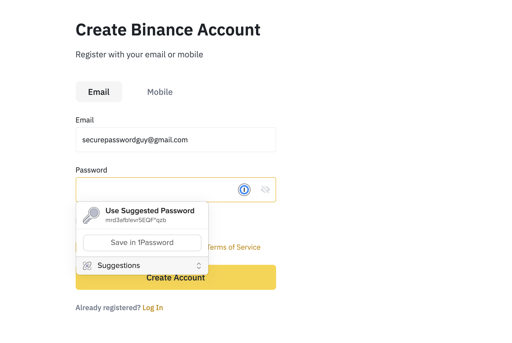
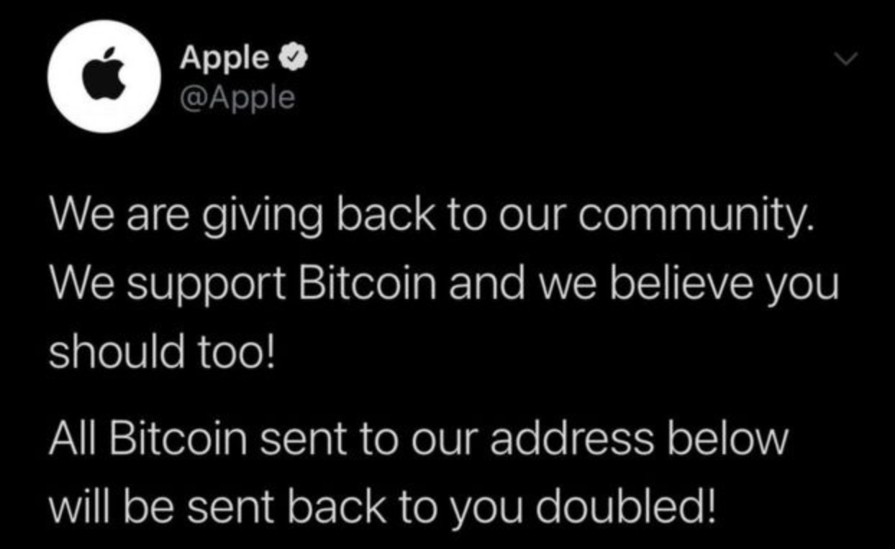

# Ethereum security and scam prevention {#introduction}

With interest in cryptocurrencies growing, learning best practices when using cryptocurrency is essential. Crypto can be fun and exciting, but there are also serious risks. If you put in this small amount of upfront work, you can mitigate these risks.

{
<Divider />
}

## Web security 101 {#web-security}

### Use strong passwords {#use-strong-passwords}

[Over 80% of account hacks are a result of weak or stolen passwords](https://cloudnine.com/ediscoverydaily/electronic-discovery/80-percent-hacking-related-breaches-related-password-issues-cybersecurity-trends/). A long combination of characters, numbers and symbols is best to keep your accounts secure.

A common mistake individuals make is using a combination of two to three common, related dictionary words. Passwords like this are insecure because they are prone to a simple hacking technique known as a [dictionary attack](https://wikipedia.org/wiki/Dictionary_attack).

```md
Example of a weak password: CuteFluffyKittens!

Example of a strong password: ymv\*azu.EAC8eyp8umf
```

Another common mistake is using passwords that can be easily guessed or found out through [social engineering](<https://wikipedia.org/wiki/Social_engineering_(security)>). Including your mother's maiden name, the names of your children or pets, or dates of birth in your password is not secure and will increase the risk of your password getting hacked.

#### Good password practices: {#good-password-practices}

- Make passwords as long as allowed by either your password generator or the form you're filling out
- Use a mixture of uppercase, lowercase, numbers and symbols
- Don't use personal details, such as family names, in your password
- Avoid common dictionary words

[More on creating strong passwords](https://terranovasecurity.com/how-to-create-a-strong-password-in-7-easy-steps/)

### Use unique passwords for everything {#use-unique-passwords}

A strong password doesn't provide as much protection if the password is revealed in a data breach. The website [Have I Been Pwned](https://haveibeenpwned.com) allows you to check if your accounts were involved in any data breaches stored in their database. If they have, **you should change pwned passwords immediately**. Using unique passwords for every account lowers the risk of hackers getting access to all of your accounts when one of your passwords is compromised.

### Use a password manager {#use-password-manager}

<InfoBanner emoji=":bulb:">
  <div>
    Using a password manager takes care of creating strong, unique passwords and remembering them! We <strong>strongly</strong> recommend using one, and most of them are free!
  </div>
</InfoBanner>

Remembering strong, unique passwords for every account you have isn't ideal. A password manager offers a secure, encrypted store for all your passwords that you can access through one strong master password. They also suggest strong passwords when signing up for a new service, so you don't have to create your own. Many password managers will also tell you if you have been involved in a data breach, allowing you to change the passwords before any malicious attacks.



#### Try a password manager: {#try-password-manager}

- [Bitwarden](https://bitwarden.com/)
- [KeePass](https://keepass.info/)
- [1Password](https://1password.com/)
- Or check out other [recommended password managers](https://www.privacytools.io/secure-password-manager)

### Use Two-Factor Authentication {#two-factor-authentication}

To prove you are actually you, there are different unique proofs that can be used for authentication. These are known as **factors** and the three main factors are:

- Something you know (such as a password or security question)
- Something you are (such as a fingerprint or iris/facial scanner)
- Something you own (a security key or authentication app on your phone)

Using **Two-Factor Authentication (2FA)** provides an additional *security factor* for your online accounts so that knowing your password alone (something you know) is not enough to access an account. Most commonly, the second factor is a randomized 6-digit code, known as a **time-based one-time password (TOTP)**, that you can access through an authenticator app such as Google Authenticator or Authy. These work as a "something you own" factor because the seed that generates the timed code is stored on your device.

<InfoBanner emoji=":lock:">
  <div>
    Note: Using SMS-based 2FA is susceptible to 
    <a href="https://www.vice.com/en/article/3kx4ej/sim-jacking-mobile-phone-fraud">
      SIM jacking
    </a>
     and is not secure. For the best security, use a service like{" "}
    <a href="https://mashable.com/article/how-to-set-up-google-authenticator">
      Google Authenticator
    </a>
     or <a href="https://authy.com/">Authy</a>.
  </div>
</InfoBanner>

#### Security keys {#security-keys}

For those who want to take the next step in 2FA, consider using a security key. Security keys are physical hardware authentication devices that work in the same way as authenticator apps. Using a security key is the most secure way to 2FA. Many of these keys utilize the FIDO Universal 2nd Factor (U2F) standard. [Learn more about FIDO U2F](https://www.yubico.com/authentication-standards/fido-u2f/).

Watch more on the 2FA:

{
<YouTube id="m8jlnZuV1i4" start="3479" />
}

### Uninstall browser extensions {#uninstall-browser-extensions}

Browser extensions like Chrome extensions or Add-ons for Firefox can augment useful browser functionality and improve user experience, but they come with risks. By default, most browser extensions ask for access to 'read and change site data', allowing them to do almost anything with your data. Chrome extensions are always automatically updated, so a previously safe extension may update later to include malicious code. Most browser extensions are not trying to steal your data, but you should be aware that they can.

#### Stay safe by: {#browser-extension-safety}

- Only install browser extensions from trusted sources
- Removing unused browser extensions
- Install Chrome extensions locally to stop auto-updating (Advanced)

[More on the risks of browser extensions](https://www.kaspersky.co.uk/blog/browser-extensions-security/12750/)

{
<Divider />
}

## Crypto security 101 {#crypto-security}

### Level up your knowledge {#level-up-your-knowledge}

One of the biggest reasons people get scammed in crypto generally is a lack of understanding. For example, if you don't understand that the Ethereum network is decentralized and owned by no one, then it's easy to fall prey to someone pretending to be a customer service agent that promises to return your lost ETH in exchange for your private keys. Educating yourself on how Ethereum works is a worthwhile investment.

<DocLink to="/what-is-ethereum/">
  What is Ethereum?
</DocLink>

<DocLink to="/eth/">
  What is ether?
</DocLink>
{
	<Divider />
}

## Wallet security {#wallet-security}

### Don't give out your private keys {#protect-private-keys}

**Never, for any reason, share your private keys!**

The private key to your wallet acts as a password to your Ethereum wallet. It is the only thing stopping someone who knows your wallet address from draining your account of all of its assets!

<DocLink to="/wallets/">
  What's an Ethereum wallet?
</DocLink>

#### Don't take screenshots of your seed phrases/private keys {#screenshot-private-keys}

By screenshotting your seed phrases or private keys, you risk syncing them to the cloud and potentially making them accessible to hackers. Obtaining private keys from the cloud is a common attack vector for hackers.

### Use a hardware wallet {#use-hardware-wallet}

A hardware wallet provides offline storage for private keys. They are considered the most secure wallet option for storing your private keys: your private key never touches the internet and stays completely local on your device.

Keeping private keys offline massively reduces the risk of being hacked, even if a hacker gets control of your computer.

#### Try a hardware wallet: {#try-hardware-wallet}

- [Ledger](https://www.ledger.com/)
- [Trezor](https://trezor.io/)

### Double check transactions before sending {#double-check-transactions}

Accidentally sending crypto to the wrong wallet address is a common mistake. **A transaction sent on Ethereum is irreversible.** Unless you know the address owner and can convince them to send you your fund back, there will be no way for you to retrieve your funds.

Always make sure the address you are sending to exactly matches the desired recipient's address before sending a transaction.
It is also recommended when interacting with a smart contract to read the transaction message before signing.

### Set smart contract spend limits {#spend-limits}

When interacting with smart contracts, do not allow unlimited spend limits. An unlimited spend could enable the smart contract to drain your wallet. Instead, set spending limits to only the amount necessary for the transaction.

Many Ethereum wallets offer limits protection to safeguard against accounts being drained.

[How to revoke smart contract access to your crypto funds](/guides/how-to-revoke-token-access/)

{
<Divider />
}

## Common scams {#common-scams}

Scammers are always looking for ways to take your funds off you. It is impossible to stop scammers completely, but we can make them less effective by being aware of the most techniques used. There are many variations of these scams, but they generally follow the same high-level patterns. If nothing else, remember:

- always be skeptical
- no one is going to give you free or discounted ETH
- no one needs access to your private keys or personal information

### Giveaway scam {#giveaway}

One of the most common scams in cryptocurrency is the giveaway scam. The giveaway scam can take many forms, but the general premise is that if you send ETH to the provided wallet address, you will receive your ETH back but doubled. *For this reason, it is also known as the 2-for-1 scam.*

These scams usually stipulate a limited time of opportunity to claim the giveaway to encourage poor decision-making and create a false sense of urgency.

#### Social media hacks {#social-media-hacks}

A high-profile version of this occurred in July 2020, when the Twitter accounts of prominent celebrities and organizations got hacked. The hacker simultaneously posted a Bitcoin giveaway on the hacked accounts. Although the deceptive tweets were quickly noticed and deleted, the hackers still managed to get away with 11 bitcoin (or $500,000 as of September 2021).



#### Celebrity giveaway {#celebrity-giveaway}

The celebrity giveaway is another common form the giveaway scam takes. The scammers will take a recorded video interview or conference talk given a celebrity and livestream it on YouTube - making it appear as though the celebrity was giving a live video interview endorsing a cryptocurrency giveaway.

Vitalik Buterin is used most often in this scam, but many other prominent people involved in crypto are also used (e.g. Elon Musk or Charles Hoskinson). Including a well-known person gives the scammers livestream a sense of legitimacy (this looks sketchy, but Vitalik is involved, so it must be ok!).

**Giveaways are always scams. If you send your funds to these accounts, you will lose them forever.**


### Support scams {#support-scams}

Cryptocurrency is a relatively young and misunderstood technology. A common scam that takes advantage of this is the support scam, where scammers will impersonate support personnel for popular wallets, exchanges, or blockchains.

Much of the discussion about Ethereum happens on Discord. Support scammers will commonly find their target by searching for support questions in public discord channels and then sending the enquirer a private message offering support. By building trust, support scammers try to trick you into revealing your private keys or sending your funds to their wallets.


As a general rule, staff will never communicate with you through private, unofficial channels. Some simple things to keep in mind when dealing with support:

- Never share your private keys, seed phrases or passwords
- Never allow anyone remote access into your computer
- Never communicate outside an organization's designated channels

<InfoBanner emoji=":lock:">
  <div>
    Beware: although support-style scams commonly happen on Discord, they can also be prevalent on any chat applications where crypto discussion happens, including email.
  </div>
</InfoBanner>

### 'Eth2' token scam {#eth2-token-scam}

In the run-up to [The Merge](/roadmap/merge/), scammers took advantage of the confusion around the term 'Eth2' to try and get users to redeem their ETH for an 'ETH2' token. There is no 'ETH2', and no other legitimate token was introduced with The Merge. The ETH that you owned before The Merge is the same ETH now. There is **no need to take any action related to your ETH to account for the switch from proof-of-work to proof-of-stake**.

Scammers may appear as "support", telling you that if you deposit your ETH, you will receive back 'ETH2'. There is no [official Ethereum support](/community/support/), and there is no new token. Never share your wallet seed phrase with anyone.

_Note: There are derivative tokens/tickers that may represent staked ETH (ie. rETH from Rocket Pool, stETH from Lido, ETH2 from Coinbase), but these are not something you need to "migrate to."_

### Phishing scams {#phishing-scams}

Phishing scams are another increasingly common angle that scammers will use to attempt to steal your wallet's funds.

Some phishing emails ask users to click on links that will re-direct them to imitation websites, asking them to enter their seed phrase, reset their password or send ETH. Others may ask you to unknowingly install malware to infect your computer and give scammers access to your computer's files.

If you receive an email from an unknown sender, remember:

- Never open a link or attachment from email addresses you don't recognize
- Never divulge your personal information or passwords to anyone
- Delete emails from unknown senders

[More on avoiding phishing scams](https://support.mycrypto.com/staying-safe/mycrypto-protips-how-not-to-get-scammed-during-ico)

### Crypto trading broker scams {#broker-scams}

Scam crypto trading brokers claim to be specialist cryptocurrency brokers who will offer to take your money and invest it on your behalf. The promises of unrealistic returns usually accompany this offer. After the scammer receives your funds, they may lead you on, asking that you send more funds, so you don't miss out on further investment gains, or they may disappear entirely.

These fraudulent brokers find their targets by using fake accounts on YouTube to start seemingly natural conversations about the broker. These conversations are often highly upvoted to increase legitimacy, but the upvotes are all from bot accounts.

**Do not trust internet strangers to invest on your behalf. You will lose your crypto.**


### Crypto mining pool scams {#mining-pool-scams}

As of September 2022, mining on Ethereum is no longer possible. However, mining pool scams still exist. Mining pool scams involve people contacting you unsolicited and claiming that you can make large returns by joining an Ethereum mining pool. The scammer will make claims and stay in contact with you for however long it takes. Essentially, the scammer will try and convince you that when you join an Ethereum mining pool, your cryptocurrency will be used to create ETH and that you will be paid dividends in the form of ETH. What will end up happening is, you will notice that your cryptocurrency is making small returns. This is simply to bait you into investing more. Eventually, all of your funds will be sent to an unknown address, and the scammer will either disappear or in some cases will continue to stay in touch as has happened in a recent case.

Bottom line, be wary of people who contact you on social media asking for you to be part of a mining pool. Once you lose your crypto, it is gone.

Some things to remember:

- Be wary of anyone contacting you about ways to make money off of your crypto
- Do your research about staking, liquidity pools, or other ways of investing your crypto
- Rarely, if ever, are such schemes legitimate. If they were, they would probably be mainstream and you will have heard of them.

[Man loses $200k in mining pool scam](https://www.reddit.com/r/CoinBase/comments/r0qe0e/scam_or_possible_incredible_payout/)

### Airdrop scams {#airdrop-scams}

Airdrop scams involve a scam project airdropping an asset (NFT, token) into your wallet and sending you to a scam website to claim the airdropped asset. You will get prompted to sign in with your Ethereum wallet and "approve" a transaction when attempting to claim. This transaction compromises your account by sending your public and private keys to the scammer. An alternative form of this scam may have you confirm a transaction that sends funds to the scammer's account.

[More on airdrop scams](https://www.youtube.com/watch?v=LLL_nQp1lGk)

{
<Divider />
}

## Further reading {#further-reading}

### Web security {#reading-web-security}

- [Up to 3 million devices infected by malware-laced Chrome and Edge add-ons](https://arstechnica.com/information-technology/2020/12/up-to-3-million-devices-infected-by-malware-laced-chrome-and-edge-add-ons/) - _Dan Goodin_
- [How to Create a Strong Password — That You Won’t Forget](https://www.avg.com/en/signal/how-to-create-a-strong-password-that-you-wont-forget) - _AVG_
- [What is a security key?](https://help.coinbase.com/en/coinbase/getting-started/verify-my-account/security-keys-faq) - _Coinbase_

### Crypto security {#reading-crypto-security}

- [Protecting Yourself and Your Funds](https://support.mycrypto.com/staying-safe/protecting-yourself-and-your-funds) - _MyCrypto_
- [Security issues in common crypto communication software](https://docs.salusec.io/untitled/web3-penetration-test/risks-in-social-media) - _Salus_
- [Security Guide For Dummies And Smart People Too](https://medium.com/mycrypto/mycryptos-security-guide-for-dummies-and-smart-people-too-ab178299c82e) - _MyCrypto_
- [Crypto Security: Passwords and Authentication](https://www.youtube.com/watch?v=m8jlnZuV1i4) - _Andreas M. Antonopoulos_

### Scam education {#reading-scam-education}

- [Guide: How to identify scam tokens](/guides/how-to-id-scam-tokens/)
- [Staying Safe: Common Scams](https://support.mycrypto.com/staying-safe/common-scams) - _MyCrypto_
- [Avoiding Scams](https://bitcoin.org/en/scams) - _Bitcoin.org_
- [Twitter thread on common crypto phishing emails and messages](https://twitter.com/tayvano_/status/1516225457640787969) - _Taylor Monahan_

{
<QuizWidget quizKey="security" />
}
