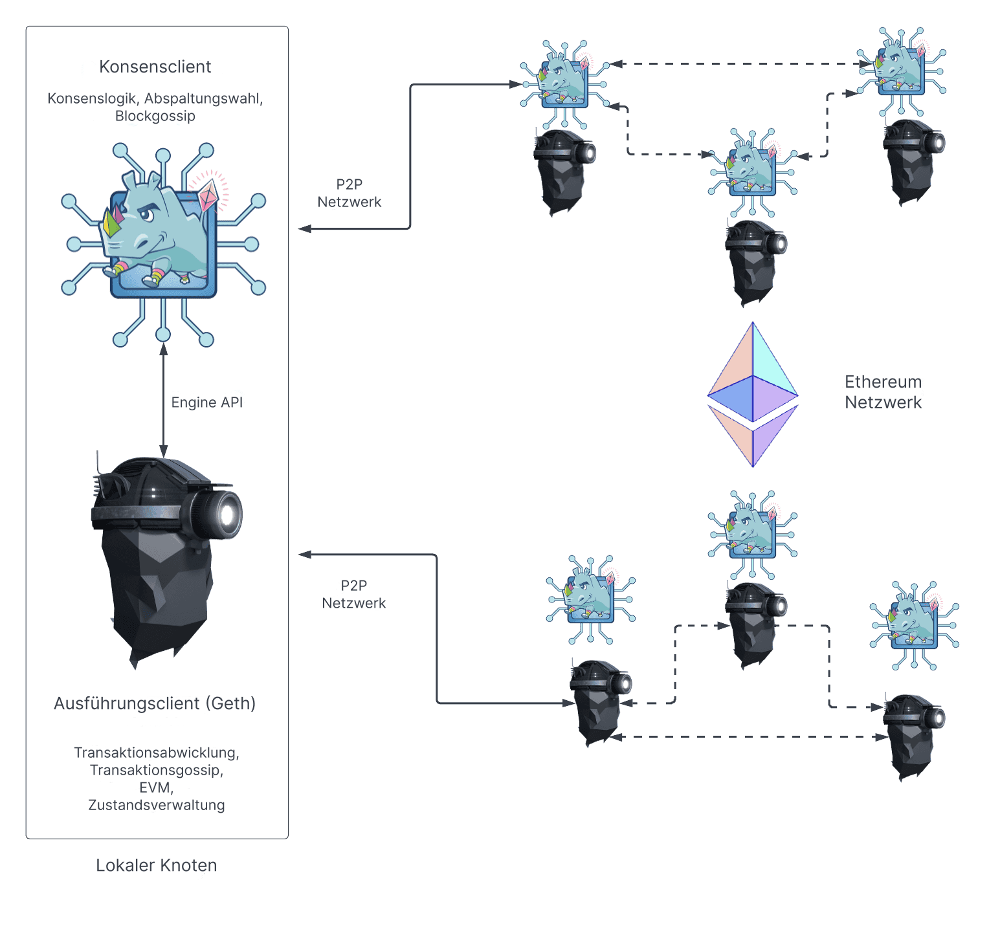

Ein Ethereum-Knoten besteht aus zwei Clients: einem [Ausführungsclient](/developers/docs/nodes-and-clients/#execution-clients) und einem [Konsensclient](/developers/docs/nodes-and-clients/#consensus-clients).

Als Ethereum noch den [Proof-of-Work](/developers/docs/consensus-mechanisms/pow/)-Algorithmus verwendete, war ein Ausführungsclient genug, um einen ganzen Ethereum-Knoten zu betreiben. Seit der Implementierung des [Proof-of-Stake](/developers/docs/consensus-mechanisms/pow/)-Algorithmus, muss der Ausführungsclient jedoch in Verbindung mit einer Software, die [„Konsensclient“](/developers/docs/nodes-and-clients/#consensus-clients) genannt wird, verwendet werden.

Das folgende Diagramm zeigt die Verbindung zwischen zwei Ethereum-Clients. Die beiden Clients verbinden sich mit ihren eigenen Peer-to-Peer(P2P)-Netzwerken. Es werden separate P2P-Netzwerke benötigt, da der Ausführungsclient Transaktionen über ihr P2P Netzwerk kommuniziert, wodurch sie ihren lokalen Transaktionspool verwalten können. Konsensclients können dabei Blöcke über ihr eigenes P2P-Netzwerk kommunizieren, was Konsens und Wachstum der Blockchain ermöglicht.

_Dieses Bild wurde von geth.ethereum.org geliehen und verwendet das Geth-Logo, um die Ausführungsclients zu repräsentieren. Es gibt andere Optionen für den Ausführungsclient, z. B. Erigon, Nethermind und Besu_

Damit diese Zwei-Client-Struktur funktioniert, müssen Konsensclients in der Lage sein Transaktionsbündel an den Ausführungsclient weiterzuleiten. Dadurch das die Transaktionen lokal ausgeführt werden, kann der Client validieren, dass die Transaktionen keine der Ethereum-Richtlinien verletzen und dass die vorgeschlagene Aktualisierung des Ethereum-Zustands korrekt ist. Wenn der Knoten als Blockerzeuger ausgewählt wird, muss der Konsensclient ebenfalls in der Lage sein, ein Bündel von Transaktionen von Geth anzufragen, damit diese Teil des neuen Blocks werden können. Er muss sie ausführen können, um den globalen Zustand zu aktualisieren. Diese Kommunikation zwischen den Clients wird durch eine lokale RPC-Verbindung unter Verwendung der [Engine API](https://github.com/ethereum/execution-apis/blob/main/src/engine/common.md) verarbeitet.

## Was macht der Ausführungsclient? \{##execution-client}

Der Ausführungsclient ist für das Verarbeiten von Transaktionen, das Vermitteln von Transaktionen, die Zustandsverwaltung und die Unterstützung der Virtuellen Ethereum-Maschine ([EVM](/developers/docs/evm/)) zuständig. Jedoch ist er **nicht** für das Erstellen von Blöcken, das Vermitteln von Blöcken oder das Verwalten der Konsenslogik zuständig. Dies sind die Aufgaben des Konsensclients.

Der Ausführungsclient erstellt Ausführungsnutzlasten – die Liste der Transaktionen, die aktualisierten Zustandsbäume, und andere ausführungsbezogene Daten. Konsensclients beinhalten die Ausführungsnutzlast in jedem Block. Der Ausführungsclient ist außerdem zuständig für das Wiederausführen von Transaktionen in einem neuen Block, um sicherzugehen, dass diese gültig sind. Transaktionen werden auf dem Computer, der in den Ausführungsclients integriert ist, ausgeführt, bekannt als die [Virtuelle Ethereum-Maschine (EVM)](/developers/docs/evm).

Der Ausführungsclient bietet außerdem eine Nutzeroberfläche für Ethereum über [RPC-Methoden](/developers/docs/apis/json-rpc), die es Nutzern ermöglicht, die Ethereum Blockchain abzufragen und Transaktionen einzuschicken sowie Smart Contracts einzusetzen. Es ist üblich, das RPC-Aufrufe von einer Bibliothek wie [Web3js](https://docs.web3js.org/),[Web3py](https://web3py.readthedocs.io/en/v5/) oder einer Nutzeroberfläche, wie z. B. einer Browser-Wallet verarbeitet werden.

Zusammengefasst ist der Ausführungsclient:

- Ein Nutzergateway zu Ethereum
- Das Zuhause der Virtuellen Ethereum-Maschine, des Zustands von Ethereums und des Transaktionspools.

## Was macht der Konsensclient? \{##consensus-client}

Der Konsensclient befasst sich mit der gesamten Logik, die ein Knoten braucht, um mit dem Ethereum-Netzwerk synchronisiert zu bleiben. Das beinhaltet das Empfangen von Blöcken von Peers und das Betreiben eines Abspaltungsalgorithmus, um sicherzugehen, dass der Knoten immer der Blockchain mit den meisten Attestierungen (gewichtet nach effektiven Guthaben von Validatoren) folgt. Ähnlich zum Ausführungsclient haben Konsensclients ihr eigenes P2P-Netzwerk, über das sie Blöcke und Attestierungen teilen können.

Der Konsensclient nimmt nicht an Attestierungen oder dem Vorschlagen von Blöcken teil. Das wird von einem Validator übernommen, eine optionale Erweiterung zu einem Konsensclient. Ein Konsensclient ohne Validator hält nur mit der Spitze der Blockchain mit, was dem Knoten ermöglicht, synchronisiert zu bleiben. Das ermöglicht dem Nutzer, Dinge mit Ethereum über ihren Ausführungsclient abzuwickeln, mit der Sicherheit, dass diese sich auf der richtigen Blockchain befinden.

## Validatoren \{##validators}

Knotenbetreiber können Validatoren zu ihren Konsensclients hinzufügen, indem sie 32 ETH in den Einzahlungsvertrag einzahlen. Der Validatorclient kommt gebündelt mit dem Konsensclient und kann zu jeder Zeit einem Knoten hinzugefügt werden. Der Validator bearbeitet Attestierungen und Blockvorschläge. Sie ermöglichen einem Knoten, Prämien zu sammeln oder ETH über Strafen oder Slashing zu verlieren. Durch das Betreiben der Validatorensoftware kann ein Knoten ausgewählt werden, um einen neuen Block vorzuschlagen.

[Mehr über Staking](/abstecken/).

## Vergleich der Knotenkomponenten \{##node-comparison}

| Ausführungsclient                                       | Konsensclient                                                                   | Validator                              |
| ------------------------------------------------------- | ------------------------------------------------------------------------------- | -------------------------------------- |
| Übermittelt Transaktionen über sein P2P-Netzwerk        | Übermittelt Blöcke und Attestierungen über sein P2P-Netzwerk                    | Schlägt Blöcke vor                     |
| Führt Transaktionen (erneut) aus                        | Betreibt den Abspaltungsalgorithmus                                             | Sammelt Prämien/Strafen                |
| Verifiziert eingehende Zustandsänderungen               | Verfolgt die Spitze der Blockchain                                              | Stellt Attestierungen aus              |
| Verwaltet Zustands- und Belegsbäume                     | Verwaltet den Beacon-Zustand (beinhaltet Konsens- und Ausführungsinformationen) | Benötigt 32 ETH, um gestaked zu werden |
| Erzeugt Ausführungsnutzlast                             | Behält Überblick über die gesammelte Zufälligkeit in RANDAO                     | Kann „abgeschlagen“ (geslashed) werden |
| Deckt JSON-RPC API auf, um mit Ethereum zu interagieren | Behält den Überblick über Begründung und Finalisierung                          |                                        |

## Weiterführende Informationen \{##further-reading}

- [Proof-of-Stake](/developers/docs/consensus-mechanisms/pos)
- [Blockvorschlag](/developers/docs/consensus-mechanisms/pos/block-proposal)
- [Prämien und Strafen für Validatoren](/developers/docs/consensus-mechanisms/pos/rewards-and-penalties)
