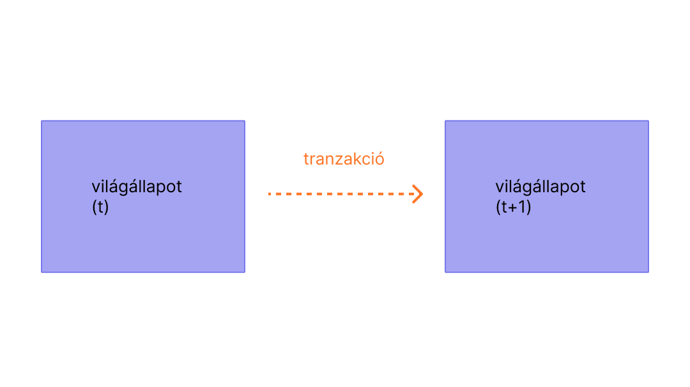
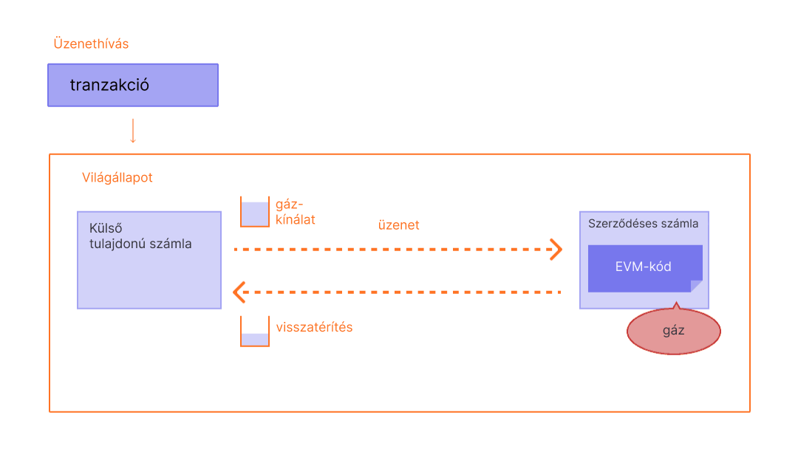

A tranzakciók számlákból származó kriptográfiailag aláírt instrukciók. Egy számla tranzakciót indíthat, hogy frissítse az Ethereum hálózat állapotát. A legegyszerűbb tranzakció az ETH átutalása egyik számláról a másikra.

## Előfeltételek {#prerequisites}

Ennek az oldalnak a jobb megértése érdekében javasoljuk, hogy először a [Számlák](/developers/docs/accounts/) és a [bevezetés az Ethereumba](/developers/docs/intro-to-ethereum/) című cikkeinket olvassa el.

## Mi az a tranzakció? {#whats-a-transaction}

Az Ethereum-tranzakció egy külső tulajdonú számla által kezdeményezett tevékenységre utal, más szóval egy számla, amelyet egy ember, nem pedig egy szerződés kezel. Például, ha Bob elküld Alice-nek 1 ETH-et, akkor Bob számláját terhelni kell, Alice számlájára pedig jóvá kell írni az összeget. Ez az állapotot megváltoztató művelet egy tranzakción belül történik.

 _Diagram átvéve az [Ethereum EVM illusztrálva](https://takenobu-hs.github.io/downloads/ethereum_evm_illustrated.pdf)_ anyagból

Az EVM állapotát megváltoztató tranzakciókat a teljes hálózat számára közvetíteni kell. Bármely csomópont kérvényezheti egy tranzakció végrehajtását az EVM-en; miután ez megtörténik, egy validátor végrehajtja a tranzakciót és továbbterjeszti az eredményül kapott állapotot a hálózat többi része számára.

A tranzakciókért fizetni kell, és be kell kerüljenek egy validált blokkba. Hogy egyszerűbb legyen ez az áttekintés, a gázdíjak és a validáció témaköröket máshol taglaljuk.

Az elküldött tranzakció a következő információkat tartalmazza:

- `from` – a küldő címe, aki aláírja a tranzakciót. Ez egy külső tulajdonú számla, mivel a szerződéses számlák nem küldenek tranzakciót.
- `recipient` – a fogadó címe (ha egy külső tulajdonú számla, akkor a tranzakció értéket továbbít. Ha egy szerződéses számla, akkor a tranzakció szerződéskódot fog végrehajtani)
- `signature` – a küldő azonosítója. Ez akkor jön létre, amikor a feladó privát kulcsa aláírja a tranzakciót, és megerősíti, hogy a küldő engedélyezte ezt a tranzakciót
- `nonce` – egy növekvő számláló, amely a számláról küldött tranzakciók számát mutatja
- `value` – az átküldendő ETH mennyisége a küldőtől a címzettnek (WEI-ben, ahol 1 ETH 1e+18 wei-nek felel meg)
- `input data` – opcionális mező tetszőleges adatok megadására
- `gasLimit` – a maximális gáz mennyisége, amelyet a tranzakció elfogyaszthat. Az [EVM](/developers/docs/evm/opcodes) határozza meg a számítási lépésekhez szükséges gázmennyiségét
- `maxPriorityFeePerGas` – az elfogyasztott gáz maximális ára, amely a validátor által kapott borravaló részét képezi
- `maxFeePerGas` – a gázegységért fizethető maximális díj, amit a tranzakcióért kifizetnek (beleértve a `baseFeePerGas` és a `maxPriorityFeePerGas` értékét is)

A gáz a tranzakció feldolgozásához szükséges számításért jár, amelyet a validátor feldolgoz. A felhasználóknak díjat kell fizetniük ezért a számításért. A `gasLimit` és a `maxPriorityFeePerGas` meghatározza a validátornak fizetett maximális tranzakciós illetéket. [Bővebben a gázról](/developers/docs/gas/).

A tranzakcióobjektum nagyjából így néz ki:

```js
{
  from: "0xEA674fdDe714fd979de3EdF0F56AA9716B898ec8",
  to: "0xac03bb73b6a9e108530aff4df5077c2b3d481e5a",
  gasLimit: "21000",
  maxFeePerGas: "300",
  maxPriorityFeePerGas: "10",
  nonce: "0",
  value: "10000000000"
}
```

De a tranzakcióobjektumot alá kell írni a küldő privát kulcsával. Ez bizonyítja, hogy a tranzakció kizárólag a küldőtől jöhetett, és nem történt csalás.

Egy Ethereum-kliens, mint a Geth, fogja kezelni az aláírási folyamatot.

Példa egy [JSON-RPC](/developers/docs/apis/json-rpc)-hívásra:

```json
{
  "id": 2,
  "jsonrpc": "2.0",
  "method": "account_signTransaction",
  "params": [
    {
      "from": "0x1923f626bb8dc025849e00f99c25fe2b2f7fb0db",
      "gas": "0x55555",
      "maxFeePerGas": "0x1234",
      "maxPriorityFeePerGas": "0x1234",
      "input": "0xabcd",
      "nonce": "0x0",
      "to": "0x07a565b7ed7d7a678680a4c162885bedbb695fe0",
      "value": "0x1234"
    }
  ]
}
```

Példa válasz:

```json
{
  "jsonrpc": "2.0",
  "id": 2,
  "result": {
    "raw": "0xf88380018203339407a565b7ed7d7a678680a4c162885bedbb695fe080a44401a6e4000000000000000000000000000000000000000000000000000000000000001226a0223a7c9bcf5531c99be5ea7082183816eb20cfe0bbc322e97cc5c7f71ab8b20ea02aadee6b34b45bb15bc42d9c09de4a6754e7000908da72d48cc7704971491663",
    "tx": {
      "nonce": "0x0",
      "maxFeePerGas": "0x1234",
      "maxPriorityFeePerGas": "0x1234",
      "gas": "0x55555",
      "to": "0x07a565b7ed7d7a678680a4c162885bedbb695fe0",
      "value": "0x1234",
      "input": "0xabcd",
      "v": "0x26",
      "r": "0x223a7c9bcf5531c99be5ea7082183816eb20cfe0bbc322e97cc5c7f71ab8b20e",
      "s": "0x2aadee6b34b45bb15bc42d9c09de4a6754e7000908da72d48cc7704971491663",
      "hash": "0xeba2df809e7a612a0a0d444ccfa5c839624bdc00dd29e3340d46df3870f8a30e"
    }
  }
}
```

- a `raw` az aláírt tranzakció a [Recursive Length Prefix (RLP)](/developers/docs/data-structures-and-encoding/rlp) által kódolt formában
- a `tx` az aláírt tranzakció JSON-ban

Az aláírás hash-sel a tranzakcióról kriptográfiailag be lehet bizonyítani, hogy a küldőtől jött és így továbbították a hálózatra.

### Az adatmező {#the-data-field}

A tranzakciók többsége egy szerződést ér el egy külső tulajdonú számláról. A legtöbb szerződést Solidity nyelven írják, az adatmezőt az [alkalmazás bináris interfész (ABI)](/glossary/#abi) alapján lehet értelmezni.

Az első négy bájt adja meg a funkciót a híváshoz, a funkció nevének és argumentumok hash-ét használva. A funkció néha beazonosítható ebből az [adatbázisból](https://www.4byte.directory/signatures/).

A hívási adat többi része az argumentumok, [az ABI-specifikáció szerint kódolva](https://docs.soliditylang.org/en/latest/abi-spec.html#formal-specification-of-the-encoding).

Nézzük meg ezt a [tranzakciót](https://etherscan.io/tx/0xd0dcbe007569fcfa1902dae0ab8b4e078efe42e231786312289b1eee5590f6a1). **Kattintson a részletekért** a hívási adatok megtekintéséért.

A funkcióválasztó a `0xa9059cbb`. Számos [ismert funkció létezik ezzel az aláírással](https://www.4byte.directory/signatures/?bytes4_signature=0xa9059cbb). Ebben az esetben [a szerződés forráskódját](https://etherscan.io/address/0xa0b86991c6218b36c1d19d4a2e9eb0ce3606eb48#code) feltöltöttük az Etherscan-be, így tudjuk, hogy a funkció a `transfer(address,uint256)`.

Az adat többi része:

```
0000000000000000000000004f6742badb049791cd9a37ea913f2bac38d01279
000000000000000000000000000000000000000000000000000000003b0559f4
```

Az ABI specifikáció szerint az integer értékek (mint a címek, amelyek 20 bájt hosszú integerek) az ABI-ban 32 bájt hosszan jelennek meg, nullákkal az elején. Így tudjuk, hogy a `to` (fogadó) cím a [`4f6742badb049791cd9a37ea913f2bac38d01279`](https://etherscan.io/address/0x4f6742badb049791cd9a37ea913f2bac38d01279). Az `value` (érték) pedig 0x3b0559f4 = 990206452.

## Tranzakciótípusok {#types-of-transactions}

Az Ethereumon található néhány tranzakciótípus:

- Általános tranzakciók: egyik számláról a másikra.
- Szerződést telepítő tranzakciók: ahol nincs „to” vagyis fogadó cím, és az adatmezőket a szerződéskódra használják.
- A szerződés végrehajtása: olyan tranzakció, amely egy telepített okosszerződéssel kapcsolódik. Ekkor a „to” vagyis fogadó cím az okosszerződés címe.

### A gázról {#on-gas}

Ahogy korábban említettük, a tranzakciók [gáz](/developers/docs/gas/)költséget igényelnek a lefutáshoz. Egy egyszerű átutalás 21 000 gázegységet igényel.

Bob 1 ETH-t küld Alice-nek, ahol a `baseFeePerGas` 190 gwei és a `maxPriorityFeePerGas` 10 gwei, így Bobnak a következő díjat kell kifizetnie:

```
(190 + 10) * 21 000 = 4 200 000 gwei
--vagyis--
0,0042 ETH
```

Bob számlája **-1,0042 ETH-val** csökken (1 ETH Alice-nek + 0,0042 ETH gázdíjakra)

Alice számlájára **+1,0 ETH** érkezik

Az elégetendő alapdíj **-0,00399 ETH**

A validátor megtartja a borravalót, ami **+0,000210 ETH**

Az okosszerződéses interakciók is gázt igényelnek.

 _Diagram átvéve az [Ethereum EVM illusztrálva](https://takenobu-hs.github.io/downloads/ethereum_evm_illustrated.pdf)_ anyagból

A tranzakcióban fel nem használt összes gáz visszakerül a felhasználó számlájára.

## Tranzakció-életciklus {#transaction-lifecycle}

Amikor valaki elküld egy tranzakciót, a következő történik:

1. A tranzakciós hash kriptográfiailag generálódik: `0x97d99bc7729211111a21b12c933c949d4f31684f1d6954ff477d0477538ff017`
2. A tranzakció ezután elterjed a hálózaton, bekerül a tranzakció gyűjtőmedencébe, ami az összes függő tranzakciót tartalmazza.
3. A validátornak ki kell választania a tranzakciót és bele kell foglalnia egy blokkba, hogy hitelesítse és „sikeresnek” minősítse.
4. Az idő múlásával a tranzakciót tartalmazó adott blokk a hitelesítettből a véglegesített állapotba jut. Ezek a frissítések biztossá teszik, hogy a tranzakció sikeres és többé nem lehet megváltoztatni. Amint a blokk végleges lesz, csak egy hálózatszintű támadás tudja megváltoztatni, ami sok milliárd dollárba kerülne a támadó részéről.

## Vizuális bemutató {#a-visual-demo}

Kövesse végig, ahogy Austin bemutatja a tranzakciókat, a gázt és a bányászatot.

{
<YouTube id="er-0ihqFQB0" />
}

## Beírt tranzakciógöngyöleg {#typed-transaction-envelope}

Az Ethereum eredetileg egyetlen formátummal rendelkezett a tranzakciókat illetően. Minden tranzakcióban a következő értékek voltak jelen: nonce, gázdíj, gázkorlátozás, a fogadó címe, az érték, adatok, v, r és s. Ezek a mezők [RLP-kódolásúak](/developers/docs/data-structures-and-encoding/rlp/), hogy így nézzenek ki:

`RLP([nonce, gasPrice, gasLimit, to, value, data, v, r, s])`

Az Ethereum tovább fejlődött, hogy többféle tranzakciót is támogatni tudjon olyan funkciók lehetővé tételéhez, mint a hozzáférési listák és a [EIP-1559](https://eips.ethereum.org/EIPS/eip-1559), és úgy tudja ezeket bevezetni, hogy ne érintsék az eredeti tranzakció formátumát.

Az [EIP-2718](https://eips.ethereum.org/EIPS/eip-2718) teszi ezt lehetővé. A tranzakciókat így interpretálják:

`TransactionType || TransactionPayload`

Ahol a mezők jelentése:

- `TransactionType` – egy szám 0 és 0x7f között, összesen 128 lehetséges tranzakciótípusra.
- `TransactionPayload` – tetszőleges bájtsor, amelyet a tranzakció típusa határoz meg.

## További olvasnivaló {#further-reading}

- [EIP-2718: Tranzakciógöngyöleg](https://eips.ethereum.org/EIPS/eip-2718)

_Ismersz olyan közösségi anyagot, mely segített neked? Módosítsd az oldalt és add hozzá!_

## Kapcsolódó témák {#related-topics}

- [Számlák](/developers/docs/accounts/)
- [Ethereum virtuális gép (EVM)](/developers/docs/evm/)
- [Üzemanyag](/developers/docs/gas/)
