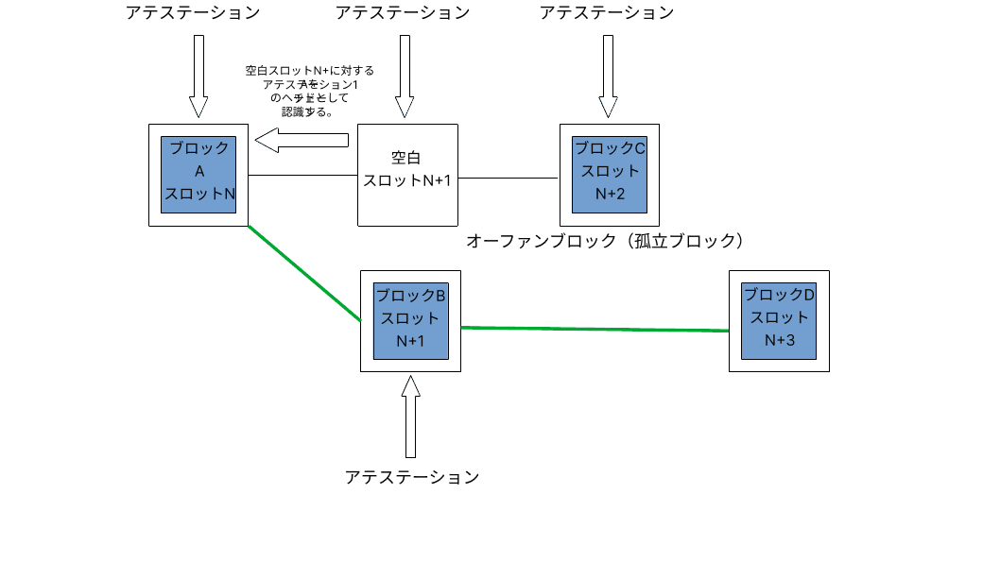

イーサリアムのクライアントソフトウェアは、常に窃盗や破壊行為の脅威にさらされています。 このページでは、イーサリアムのコンセンサスレイヤーに対する既知の攻撃ベクトルについて概説し、これらの攻撃をどのように防ぐべきかについて説明します。 このページの内容は、[こちらの長文バージョン](https://mirror.xyz/jmcook.eth/YqHargbVWVNRQqQpVpzrqEQ8IqwNUJDIpwRP7SS5FXs)を要約したものです。

## 前提知識 \{#prerequisites}

[プルーフ・オブ・ステーク](/developers/docs/consensus-mechanisms/pos/)の基本的な知識が必要です。 また、イーサリアムの[インセンティブレイヤー](/developers/docs/consensus-mechanisms/pos/rewards-and-penalties)とフォーク選択アルゴリズム、[LMD-GHOST](/developers/docs/consensus-mechanisms/pos/gasper)について基礎的に理解しておくとよいでしょう。

## 攻撃者はどんな目的を持っているのか？ \{#what-do-attackers-want}

イーサリアムに対する攻撃については、攻撃が成功した場合に新規のイーサを生成したり、ランダムに選んだアカウントからイーサを盗み取ることが可能だ、と誤解している人が多いです。 実際にはこれらは不可能です。なぜなら、イーサリアムにおけるすべてのトランザクションは、イーサリアム・ネットワークに含まれるすべての実行クライアントにより実行されるからです。 トランザクションが有効であるためには基本的な条件を満たす必要があり（送信者の秘密鍵を使って署名されており、送信者の残高が十分であるなど）、これらの条件を満たさない場合には、トランザクションを実行する前の状態に復元されます。 このため、攻撃者が現実的に望みうるのは、再編成、二重ファイナリティ、またはファイナリティの遅延という 3 つの結果だけです。

**「再編成」**とは、ブロックの順番が変更されるようにシャッフルすることであり、正規チェーンに新たなブロックを追加したり、既存のブロックが削除される場合が多いです。 悪意に基づく再編成は特定のブロックを追加／削除することを目的とする場合があり、トランザクションをフロントランニング／バックランニングすることで、二重支出や価値の抜き取りが可能になります。 再編成はまた、特定のトランザクションが正規チェーンに追加されないようにするために用いられる場合もあり、これは一種の検閲を目指すものだと言えます。 再編成攻撃のうち最も極端なものは「ファイナリティの取消」であり、すでにファイナライズされたブロックを除去／置換するものです。 この攻撃では、攻撃者はステーキングされたイーサの合計のうち 3 分の 1 以上を破壊しなければなりません。この保証を「経済的なファイナリティ」と呼びますが、詳細については以下で説明します。

**二重ファイナリティ**とは、2 つのフォークが同時にファイナライズ可能な状態に置かれ、チェーンに永続的な亀裂が生じるもので、発生確率は低いですが非常に深刻な状況だと言えます。 理論的には、攻撃者がステーキングされた ETH 全体の 34%を失っても構わないと考える場合にこの状態が発生可能になります。 ユーザーコミュニティは、オフチェーンでの議論を通じてどのチェーンに従うかを決定することを迫られますので、ソーシャルレイヤーの強じんさが求められます。

**ファイナリティ遅延**攻撃とは、チェーンにおいてファイナライズを必要とするセクションが、ファイナライズに必要な条件を満たすのを妨害するものです。 ファイナリティを実現できなければ、イーサリアムを基盤として開発された財務アプリケーションを信頼しにくくなります。 攻撃者が戦略的なショートポジションを持つ場合を除き、ファイナリティ遅延攻撃の目的は直接的な利益を得るためというよりも、単にイーサリアムのネットワークを混乱させることである場合が多いでしょう。

ソーシャルレイヤーに対する攻撃は、イーサリアムに対する世間の信頼を毀損するため、イーサの価値や利用度を引き下げるため、あるいは、イーサリアム・コミュニティを弱体化させることにより、帯域外の連携を妨害することを目的とするかもしれません。

以上が、攻撃者がイーサリアムを攻撃する理由として考えられるものです。以下のセクションでは、これらの攻撃を*どのように実行するか*について検討します。

## さまざまな攻撃手段 \{#methods-of-attack}

### レイヤー 0 攻撃 \{#layer-0}

まず、イーサリアム・ネットワークへの積極的な関与（クライアント・ソフトウェアを実行すること）を行わない攻撃者は、ソーシャルレイヤー（レイヤー 0）を標的とする攻撃を行う可能性があります。 レイヤー 0 は、イーサリアム・ネットワークを構築するための土台であり、攻撃対象となった場合はその影響がスタックの他の部分に波及しかねません。 具体的には、以下のような攻撃が考えられます：

- 虚偽情報を流布するキャンペーンを行うことで、ユーザーコミュニティにおけるイーサリアムのロードマップ、開発者チーム、アプリ等に対する信頼を失わせる攻撃。 この攻撃は、イーサリアム・ネットワークのセキュリティを維持するために参加するユーザーの数を減少させることで、分散化および暗号経済的なセキュリティを低下させる意図を持ちます。
- 開発者コミュニティに対する標的を絞った攻撃および／または脅迫。 この攻撃により、開発者が自発的にコミュニティから退去し、イーサリアムの開発速度が遅れる可能性があります。

- 必要以上に規制を厳しくすることも、イーサリアムへの参加者数や利用度を大きく引き下げる可能性を持つため、レイヤー 0 に対する攻撃と見なすことが可能です。
- 関連知識を持つ悪意のアクターが開発者コミュニティに侵入する場合。ここでの目的は、些末な議論を繰り広げたり、重要な判断を遅らせたり、スパムを送信するなどの方法により、イーサリアムの開発を遅らせることです。
- イーサリアムのエコシステムに含まれるキープレイヤーに対して賄賂を提供して、意思決定に影響を及ぼそうとする行為。

これらの攻撃がとりわけ危険な理由は、ごくわずかな資本あるいは技術的ノウハウしか持たない者でも実行が可能である場合が多いためです。 レイヤー 0 攻撃は、暗号経済的な攻撃の被害をさらに拡大する可能性があります。 例えば、悪意のある多数派のステークホルダーにより検閲やファイナリティの撤回が達成された場合、ソーシャルレイヤーが弱体化していれば、帯域外においてユーザーコミュニティ全体が団結して対応することが難しくなるかもしれません。

レイヤー 0 攻撃に対して防御するにはおそらく複雑な手段を講じる必要がありますが、いくつかの基本的な原則が考えられます。 第 1 に、イーサリアムに関する公開情報の全般的な精度を高めることです。つまり、ユーザーコミュニティにおける誠実なメンバーが、ブログ、Discord サーバー、注釈付き仕様、書籍、ポッドキャスト、YouTube 動画等を通じて、イーサリアムに関する正しい情報を作成、公開する必要があります。 ethereum.org では、常に正確な情報を提供し、できるだけ多くの言語に翻訳しようと尽力しています。 質が高い情報およびミームを常に提供することで、虚偽情報の流通を効果的に防ぐことができます。

ソーシャルレイヤーを標的とする攻撃に対するもう 1 つの重要な防御策は、明確なミッションステートメントおよびガバナンスプロトコルです。 イーサリアムは、スマートコントラクトのレイヤー 1 の中でも最も重要な分散性とセキュリティを誇るプラットフォームであり、同時にスケーラビリティやサステナビリティも非常に重視しています。 イーサリアム・コミュニティの内部でいかなる意見の相違が発生したとしても、これらの基本原則が揺らぐことはほぼありません。 これらの基本原則から逸脱した主張を吟味し、EIP（イーサリアム改善提案）のプロセスに基づく一連のレビューラウンドを通じて検証することで、ユーザーコミュニティ内部における善意のアクターと悪意のアクターを区分し、悪意のアクターがイーサリアムの将来的な方向性に悪影響を及ぼす可能性を抑えることが可能になるでしょう。

最後に、イーサリアムは、今後も引き続きすべての参加者を歓迎する開かれたコミュニティでなければなりません。 利用者を制限する機能を持つ排他的なコミュニティは、「内部と外部」という対立構造を持ちやすいため、ソーシャル攻撃に対して特に脆弱になります。 部族主義や有害な最大化至上主義は、コミュニティの健全性を傷つけ、レイヤー 0 のセキュリティを低下させます。 イーサリアム・ネットワークのセキュリティを守りたいと考えるイーサリアム・ユーザーは、オンラインおよび実世界における自らの行動がイーサリアムのレイヤー 0 におけるセキュリティの維持に直接影響を及ぼすという認識を持つ必要があります。

### プロトコルへの攻撃 \{#attacking-the-protocol}

イーサリアムのクライアント・ソフトウェアは、誰でも実行できます。 クライアントにバリデータを追加するには、入金コントラクトに 32 イーサをステークとして入金しなければなりません。 バリデータを追加すると、新規ブロックの提案およびアテステーションを実行することで、イーサリアム・ネットワークのセキュリティ強化の取り組みに積極的に貢献することができます。 バリデータとなることで、イーサリアム・ブロックチェーンの今後の状況に影響を及ぼすことができます。誠実なユーザーであれば、報酬を獲得してより多くのイーサを蓄えることができ、悪意のユーザーであれば、私益のためにイーサリアムのプロセスを不正に操作することも可能になりますが、この場合は自らのステークを失うリスクがあります。 イーサリアム・ネットワークを攻撃するひとつの手段として、自分のステークが全体に占める割合を大きくすることで、誠実なバリデータを上回る投票を行う方法があります。 攻撃者が支配するステークの割合が大きくなればなるほど投票権が大きくなり、特に一部の経済的なマイルストーンにおいてはその影響力が強まりますが、これについては以下で詳しく説明します。 ただし、大部分の悪意のユーザーはこの方法で攻撃を行うために必要なイーサを蓄積できないため、より巧妙なテクニックを用いて、多数派である率直なユーザーに対して自分が望むように行動するように促すという手段を用いるのです。

根本的に、少額のステークを利用したすべての攻撃は、アクティビティの欠如（アテステーション／ブロック提案を実行しないか、実行を遅延する）あるいは過剰なアクティビティ（特定スロットにおいて過剰に提案／アテステーションする）という 2 種類の悪意の行為のさまざまなバリエーションだと考えることができます。 このような攻撃のうち最も軽微なものは、フォーク選択アルゴリズムおよびインセンティブレイヤーにより容易に回避できますが、より悪辣な方法を通じて、イーサリアムのシステム全体を攻撃者にとって有利になるように操作することも可能です。

### 少額の ETH を用いた攻撃 \{#attacks-by-small-stakeholders}

#### 再編成 \{#reorgs}

ステーキングされたイーサ全体のごく一部を用いて、チェーンの再編成またはファイナリティの遅延を実行するという攻撃については、すでにいくつかのペーパーにより詳説されています。 これらの攻撃は通常、攻撃者以外のバリデータに対して一部の情報を秘匿しておき、特定のニュアンスを持つ方法で、および／または攻撃者にとって有利な時点で、その情報を公開するという手段を用います。 攻撃者は通常、一部の誠実なブロック（複数の場合あり）を正規チェーンから削除することを目的とします。 [ノイダー他（2020 年）](https://arxiv.org/pdf/2102.02247.pdf)の論文では、攻撃者であるバリデータが特定のスロット `n+1` に対してブロック(`B`) を作成し、アテステーションを実行しつつ、ネットワークの他のノードへの送信を控える方法について説明しています。 攻撃者は、アテステーションを実行したブロックを次のスロット（`n+2`まで公開せずに残しておきます。 誠実なバリデータは、あるブロック（`C`）を`n+2`スロットに提案します。 攻撃者は、これとほぼ同時に、秘匿していたブロック（`B`）およびこれに対するアテステーションをリリースし、さらに、十分な投票権と共にスロット`n+2`におけるチェーンの先頭が`B`であるというアテステーションを実行することで、誠実なブロック`C`の存在を事実上否定することができます。 誠実なブロック `D` がリリースされると、フォーク選択アルゴリズムにより、ブロック`B`上で構築された`D`の方が、ブロック`C`上で構築されたブロック`D`よりも重みが大きいと判断します。 つまり攻撃者は、1 つ後のブロックにおけるチェーンの再編成により、スロット`n+2`における誠実なブロック`C`を正規チェーンから削除することが可能になるのです。 [攻撃者がステーク全体の 34%を保有する場合](https://www.youtube.com/watch?v=6vzXwwk12ZE)、[この注記](https://notes.ethereum.org/plgVdz-ORe-fGjK06BZ_3A#Fork-choice-by-block-slot-pair)で述べられているように、この攻撃が成功する可能性は非常に高いと言えます。 さらに、理論的にはより少ない割合のステークでもこの攻撃を試みることが可能です。 [ノイダー他（2020 年）](https://arxiv.org/pdf/2102.02247.pdf)では、この攻撃は 30%ステークでも可能だと述べていますが、その後の研究により、[ステーク全体のわずか 2%](https://arxiv.org/pdf/2009.04987.pdf)を保有するだけでこの攻撃が可能であると判明しました。この場合、[単独のバリデータ](https://arxiv.org/abs/2110.10086#)によるバランシングのテクニックが用いられますが、これについては以下のセクションで検証します。

上記の 1 ブロック後の再編成攻撃の概念図 (https://notes.ethereum.org/plgVdz-ORe-fGjK06BZ_3A#Fork-choice-by-block-slot-pair を修正)

さらに洗練された攻撃手法としては、誠実なバリデータ群におけるチェーンの先頭についての意見を分裂させるというものがあります。 これは、**バランシング攻撃**と呼ばれます。 攻撃者は、ブロック提案を行う機会をうかがい、その機会が到来すると曖昧化により 2 つのブロックを提案します。 具体的には、一方のブロックを誠実なバリデータ群の半数に送信し、他方のブロックを残りの半数に送信するのです。 このような曖昧化はフォーク選択アルゴリズムにより検出され、ブロック提案者はスラッシングされた上でネットワークから強制退去されますが、提案された 2 つのブロックは存在し続けるため、バリデータの半数ずつが両方のフォークにアテステーションを実行した状況が継続します。 これと同時に、追放されていない悪意のバリデータは、アテステーションを実行しない状態を維持します。 次に、フォーク選択アルゴリズムが実行される時点で、一方または他方のフォークが十分なバリデータを獲得できるように選択的にアテステーションを送信することで、いずれかのフォークに有利になるようにアテステーションの累積した重みをどちらかに傾かせることができるのです。 この攻撃は、攻撃者が 2 つのフォーク間でバリデータを等しく分割し続けられれば、際限なく継続することができます。 分岐したフォークはいずれも 3 分の 2 というスーパーマジョリティを獲得できないため、ネットーワークにおいてファイナライズすることができなくなります。

**バウンス攻撃**も、バランシング攻撃に類似しています。 この場合も、攻撃者であるバリデータが投票を回避します。 しかしバランシング攻撃の場合のように 2 つのフォークに対する投票が同数となるようにする代わりに、適当な時期に投票することでフォーク A とフォーク B において交互にチェックポイントが発生するようにします。ソースとターゲットのチェックポイントは、それぞれ異なるフォークに存在するために正当化されたペアにならず、どちらのチェーンにおいてもファイナライズが実行できないため、ファイナリティが中断されてしまうのです。

<YouTube id="xcPxwhrg3Ao"/>

バランシング攻撃およびバウンス攻撃のいずれも、ネットワークにおけるメッセージ送信のタイミングを攻撃者が非常に細かく制御できなければならず、実際に発生する可能性は高くありません。 攻撃の可能性は低いものの、これらの攻撃に対する防御手段として、プロトコルにおいては迅速なメッセージがよりメッセージよりも重みが大きくなるように設定されています。 これは、[提案者重みブースティング](https://github.com/ethereum/consensus-specs/pull/2730)と呼ばれています。 また、バウンス攻撃を回避するため、正当化された最新のチェックポイントを代替のチェーンに切り替えできる時期が[エポック全体の前半 3 分の 1 のスロット](https://ethresear.ch/t/prevention-of-bouncing-attack-on-ffg/6114)のみとなるようにフォーク選択アルゴリズムが修正されました。 この条件により、攻撃者が後で投票するための投票権を蓄積することが不可能になりました。フォーク選択アルゴリズムは、大部分の誠実なバリデータが投票するであろう各エポックの前半 3 分の 1 の時間内において選択されたチェックポイントをそのまま選択し続けるからです。

これらの対策を組み合わせた場合、誠実なブロック提案者が各スロットの開始時点でただちにブロックを送信するが、スロットの前半 3 分の 1（4 秒間）においては、新規ブロックの生成によりフォーク選択アルゴリズムを通じて他のチェーンへの切り替えが可能な状態が発生するというシナリオが想定されます。 この締切時間が到来した後は、作業が遅いバリデータから送信されたアテステーションは、作業が早いバリデータからのアテステーションよりも重みが小さくなるのです。 これにより、チェーンの先頭を決定する作業において迅速に行動した提案者およびバリデータが有利になるため、バランシング攻撃やバウンス攻撃が成功する確率を大きく引き下げることができます。

ただし、この提案者に対する重みの追加という対策は、少額のステークを用いた攻撃（つまり、「安価な再編成」）のみに有効である点に注意が必要です。 実際、提案者に対する重みの追加という手段自体が、より大規模なステークホルダーにより悪用される可能性があります。 [この投稿](https://ethresear.ch/t/change-fork-choice-rule-to-mitigate-balancing-and-reorging-attacks/11127)の作者は、ステーク全体の 7%を保有する攻撃者が、戦略的な投票行動を通じて誠実なバリデータに対して自分たちに有利なフォークを選択させ、誠実なブロックを再編成する方法を説明しています。 この攻撃手段は、実際には発生する可能性が非常に低い理想的なレイテンシー条件を想定して編み出されたものです。 攻撃者にとっては成功する確率は非常に低く、より多くの資本が危機にさらされるため、この攻撃に対しては大きな経済的な阻害要因が存在すると言えます。

[特に LMD ルールを標的とするバランシング攻撃](https://ethresear.ch/t/balancing-attack-lmd-edition/11853)も提案されており、これは提案者に対する重みの追加を用いても回避できないことが示唆されています。 この場合、攻撃者は曖昧なブロック提案を行い、各ブロックをネットワークのほぼ半分づつに送信することで 2 つのフォークがほぼ均等となるように設定することで、2 つのフォーク間の競合状態を発生させます。 次に、攻撃者と共謀するバリデータも曖昧な投票行動を行いますが、そのタイミングを調整して、ネットワークの半数がフォーク`A`への投票を先に受け取り、もう一方の半数がフォーク`B`への投票を先に受け取るようにします。 LMD ルールでは、バリデータごとに先のアテステーションを維持し、2 番目のアテステーションを放棄することになっているので、ネットワークの半数に対しては`A`への投票が表示され、`B`への投票が表示されない一方で、もう一方の多数に対しては、`B`への投票が表示され、`A`への投票が表示されなくなります。 この記事では、LMD ルールがどのようにバランシング攻撃を実行する攻撃者に対して「驚くべき力」を与えてしまうのかについて説明しています。

しかし、この LMD を悪用した攻撃ベクトルは、曖昧化を試みるバリデータを、そもそもフォーク選択の判断に関与させないという[フォーク選択アルゴリズムの修正](https://github.com/ethereum/consensus-specs/pull/2845)により実行できなくなりました。 さらにこのフォーク選択アルゴリズムの修正により、曖昧化を試みるバリデータは今後影響力を行使できなくなりました。 これにより、アバランチ攻撃に対する強じん性を維持しつつ、上記のバランシング攻撃が回避できるようになりました。

[**アバランチ攻撃**](https://ethresear.ch/t/avalanche-attack-on-proof-of-stake-ghost/11854/3)と呼ばれるもう 1 つの種類の攻撃については、[2022 年 3 月に発表された論文](https://arxiv.org/pdf/2203.01315.pdf)で説明されています。 アバランチ攻撃を実行するには、攻撃者が連続するいくつかのブロックの提案者に対して支配力を持つ必要があります。 攻撃者は、ブロック提案の各スロットにわたりブロックを保留しておき、誠実なチェーンが同等のサブツリーの重みに達するまで保留したブロックを収集します。 その上で、保留したブロックを送信し、最大限の曖昧化の効果を発生させるのです。 この論文の著者たちによれば、バランシング攻撃およびバウンス攻撃に対して最も有効な防御手段である提案者に対する重みの追加は、一部のアバランチ攻撃に対しては無効であると示唆しています。 しかしこの著者たちが示したのは、イーサリアムのフォーク選択アルゴリズムのうち高度に理想化されたバージョンに対する攻撃についてのみでした（LMD を含まない GHOST が用いられました）。

アバランチ攻撃の脅威は、LMD-GHOST というフォーク選択アルゴリズムの LMD によって軽減されます。 LMD とは、「最新メッセージ主導型」を意味し、各バリデータが維持し、他のバリデータから受信する最新のメッセージが含まれている表を指しています。 このフィールドが更新されるのは、各バリデータの表においてすでに記入済みであるスロットよりも後のスロットにおいて新規メッセージを受信した場合のみです。 これにより、実際には各スロットにおいて最初に受信されたメッセージが認証され、その後のすべてのメッセージは曖昧化をもたらすものとして却下されます。 つまり、コンセンサス・クライアントは曖昧化をもたらすメッセージを考慮せず、各バリデータから最初に受信したメッセージのみを採用し、その後の曖昧化させるメッセージは単に無視されるため、アバランチ攻撃が不可能になります。

提案者の重み追加が提供するセキュリティをさらに強めるために、フォーク選択ルールに対しては今後もいくつかのアップデート案が検討されています。 そのうちの 1 つが [ビュー・マージ](https://ethresear.ch/t/view-merge-as-a-replacement-for-proposer-boost/13739)であり、アテステーションを行うユーザーは、各自のフォーク選択のビューが当該スロットが開始される`n`秒前にフリーズされるため、提案者はネットワーク全体にわたるチェーンビューを同期しやすくなります。 もう 1 つのアップグレード案は、 [シングルスロット・ファイナリティ](https://notes.ethereum.org/@vbuterin/single_slot_finality)であり、1 スロット後にチェーンをファイナライズすることにより、メッセージを送信するタイミングに基づいた攻撃を回避するというものです。

#### ファイナリティ遅延 \{#finality-delay}

低コストで単一ブロックを対象とする再編成攻撃について説明したのと[同じ論文](https://econcs.pku.edu.cn/wine2020/wine2020/Workshop/GTiB20_paper_8.pdf)では、さらに、攻撃者がエポックの境界となるブロックの提案者となることで実行可能になるファイナリティ遅延（「生存性障害」とも呼ばれます）攻撃についても説明されています。 この攻撃が非常に重要であるのは、エポック境界ブロックはキャスパー FFG がチェーンの各部分をファイナライズするために参照するチェックポイントになるためです。 攻撃者は、ひとつ前のエポック境界ブロックを現在のファイナライズ対象にすることを支持する誠実なバリデータによる投票が十分に集まるまで、自分のブロックを保留するだけでよいのです。 攻撃者はその上で、保留してきたブロックをリリースします。 彼らは自らのブロックに対するアテステーションを実行し、攻撃者以外の誠実なバリデータも同様に実行するので、ターゲットのチェックポイントが異なる複数のフォークが作成されてしまうのです。 適切なタイミングで実行された場合、いずれのフォークに対するアテステーションにおいても 3 分の 2 のスーパーマジョリティを得られないため、ファイナリティを実現できなくなります。 この場合、ステークの規模が小さければ小さいほど、攻撃が成功する実行のタイミングが狭まります。と言うのも、攻撃者が直接支配するアテステーションの数がより少なくなり、特定のエポック境界ブロックを提案するバリデータを攻撃者が支配する可能性が低くなるからです。

#### ロングレンジ攻撃 \{#long-range-attacks}

プルーフ・オブ・ステークを採用したブロックチェーン特有のもう一つの攻撃カテゴリーとして、ジェネシスブロックの作成に関与したバリデータが誠実なチェーンとは異なる別途のフォークを維持し、最終的に誠実なバリデータ群に対し、かなりの時間を経た適当なタイミングで代替フォークに移行するように説得するという手法があります。 イーサリアムにおいては、ファイナリティ・ガジェットによりすべてのバリデータが誠実なチェーンについて定期的な感覚（「チェックポイント」）において同意する必要があるため、この種の攻撃は実行できません。 このシンプルなメカニズムによりイーサリアムのクライアントにおいてはファイナライズされたブロックの再編成が不可能であり、ロングレンジ攻撃は無効化されます。 イーサリアム・ネットワークに新たに参加するノードは、信頼できる最新状態のハッシュ（「[弱い主観性](https://blog.ethereum.org/2014/11/25/proof-stake-learned-love-weak-subjectivity/)チェックポイント」）を見つけ、このチェックポイントを疑似的なジェネシスブロックとして、その上に新たなブロックを作成します。 この方法により、新たにネットワークに参加するノードに対して「信頼性ゲートウェイ」が提供され、ノード自身が情報を検証できるようになります。

#### サービス拒否 (DOS) \{#denial-of-service}

イーサリアムにおけるプルーフ・オブ・ステークのメカニズムでは、すべてのバリデータの中から、各スロットにおけるブロック提案者として 1 名のバリデータを選出します。 この選出は公開された関数を用いて計算できるため、攻撃者は、ブロック提案のタイミングをわずかに先立つ時点で次のブロック提案者を特定することが可能です。 攻撃者はこの情報を得ることで、次のブロック提案者にスパムを送信し、他のピアとの情報交換を妨げることができます。 ネットワークの他のユーザーにとっては、次のブロック提案者がオフラインになり、スロットは空のままであるように見えます。 これは、特定のバリデータを対象とする一種の検閲として機能させることができ、それらのユーザーがブロックチェーンに情報を追加するのを妨害することが可能です。 単独非公開リーダー選挙（SSLE）あるいは非単独非公開リーダー選挙を実施する場合、当該のブロック提案者自身のみが提案者に選出されたことを知ることができ、選出を事前に知ることが不可能になるため、DoS リスクを軽減することができます。 このようなメカニズムはまだ実装されていませんが、積極的な[研究開発](https://ethresear.ch/t/secret-non-single-leader-election/11789)が進められています。

以上の説明はすべて、ステークが小規模なユーザーがイーサリアムへの攻撃を成功させることが非常に困難であることを示しています。 ここで紹介した実行可能な攻撃はいずれも、理想的なフォーク選択アルゴリズム、非現実的なネットワーク状況、あるいはクライアント・ソフトウェアに対する比較的小規模なパッチ修正によりすでに実行不可能になった攻撃ベクトルを前提としています。 もちろん、ゼロデイ攻撃が発生する可能性を否定することはできませんが、小規模のステークに基づく攻撃が成功するためには、非常に高い水準の技術的な能力、コンセンサスレイヤーに関する知識、および運が要求されることを示しています。 攻撃者の立場で考えた場合、できるだけ多くのイーサを蓄積した上で、ステーク全体に対する支配力を高めることが攻撃の成功率を高める最善の手段だと言うことになるでしょう。

### >= 33%のステークを用いた攻撃 \{#attackers-with-33-stake}

これまでに紹介したすべての攻撃手段は、攻撃者が投票できるステークの規模を大きくし、各スロットでブロックを提案するバリデータとして選出される可能性が高まるほど、成功する確率が高まります。 従って、悪意のバリデータはできる限り多くのステーキングされたイーサを支配しようとするでしょう。

攻撃者がステークされたイーサ全体の 33%をひとつのベンチマークとして捉えるのはなぜかと言えば、このしきい値を超えた場合、他のバリデータの行動を精密に管理することなく、チェーンのファイナライズを妨害できるようになるためです。 その他のバリデータの行為は意味がなくなるのです。 ステークされたイーサ全体の 3 分の 1 以上が悪意によるアテステーションを行うか、アテステーションを怠る場合、3 分の 2 のスーパーマジョリティは存在せず、チェーンはファイナライズできなくなります。 この攻撃に対する防御手段は、インアクティブ・リークです。 インアクティブ・リークとは、アテステーションを実行しない／多数派とは異なるアテステーションを行うバリデータを特定する仕組みです。 アテステーションを行わないバリデータが所有するステーク済みのイーサは徐々に縮小され、最終的に全体の 3 分の 1 未満になるため、この時点でチェーンのファイナライズが可能になるのです。

インアクティブ・リークは、チェーンが再度ファイナライズ可能な状態にナルコとを目的とするメカニズムです。 しかし同時に、攻撃者は自分がステークしたイーサの一部を失います。 つまり、ステークされたイーサ全体の 33%を占めるバリデータが継続的にアテステーションを実行しない場合、彼らのステークはスラッシングされなくてもかなり減額されてしまうのです。

イーサリアム・ネットワークが非同期型である（つまり、メッセージの送受信に遅延が生じる）と想定すると、ステーク全体の 34%を支配する攻撃者は二重ファイナリティを発生させることができます。 これは、攻撃者がブロック作成者に選出された場合、曖昧化を実行し、支配するバリデータ全員と共に二重投票が可能になるからです。 これは、ブロックチェーンに分岐が発生し、それぞれのフォークに対してステークされたイーサの 34%が投票するという事態を招きます。 各フォークがスーパーマジョリティの支持を得るには、残りのバリデータのうち 50%の投票を得ればよいので、どちらのチェーンもファイナライズが可能になってしまいます（つまり、攻撃者であるバリデータの 34%と、残余のバリデータの 66%の半分を足すと、各フォークが 67%を達成できます）。 競合するブロックは誠実なバリデータのうちおよそ 50%の投票を得る必要があるので、この攻撃が成功するためには、ネットワークにメッセージが伝播される他ミングを攻撃者がある程度管理でき、誠実なバリデータを各チェーンに半分づつ振り分けられなければなりません。 攻撃者がこの二重ファイナリティを達成するには、支配下である 34%のバリデータは二重投票を同時に実行する必要があり、これは最大の相関ペナルティが科せられるスラッシング対象の違反行為であるため、攻撃者のステーク全体（現在、バリデータによる合計ステークはおよそ 1,000 万イーサなので、その 34%）を破壊する必要があります。 この攻撃に対する防御策は、ステークされたイーサ全体の 34%を破壊することであるため、非常に大きなコストを伴います。 この攻撃から復旧するには、イーサリアム・コミュニティ全体が「帯域外」で連携し、フォークの一方を正当として、もう一方を破棄することに同意する必要があります。

### ステーク全体の最大 50%を支配する攻撃者の場合 \{#attackers-with-50-stake}

悪意のバリデータ集団がステークされたイーサ全体の 50%に対する支配力を持つ場合、理論的にはチェーンを同サイズの 2 つのフォークに分割し、彼らが持つ 50%のステーク全体を用いて誠実なバリデータ群とは異なる投票を行うことで、2 つのフォークが存在する状態を維持し、ファイナリティの実現を妨げることができます。 最終的には、両方のフォークに対するインアクティブ・リークを実行することで、両方のチェーンがファイナライズされることになるでしょう。 この場合は、ソーシャルリカバリーの力に頼るしかありません。

誠実なバリデータ数やネットワーク遅延などの値が常に流動的であることを考慮すると、悪意のバリデータ集団がステーク全体に対して正確に 50%の支配権を維持できる可能性はきわめて低く、このような攻撃の実行は非常にコストが高く、成功率が低いことを考えると、特にわずかな追加投資により 50%*以上*のステークを取得すればさらに大きな攻撃力を得られることを考えると、合理的な攻撃者がこの手段を講じる可能性は少ないと言えるでしょう。

攻撃者がステーク合計の 50%以上を支配する場合、フォーク選択アルゴリズムを操作することが可能になります。 この場合、攻撃者は多数派の投票に基づくアテステーションが可能になるため、誠実なクライアントを騙す必要なしに、ショートレンジの再編成攻撃を実行するために十分な支配権を持つことになります。 この場合、誠実なバリデータも、彼らのフォーク選択アルゴリズムが攻撃者の選好チェーンの重みが最も大きいと判断するために攻撃者の支持に従い、チェーンがファイナライズ可能になります。 攻撃者は、このメカニズムを通して特定のトランザクションに対する検閲やショートレンジの再編成攻撃を実行することで、自らが有利になるようにブロックを再編成し、最大限の MEV を抽出することが可能になります。 この攻撃を防ぐには、ソーシャルレイヤーの介入により、誠実な少数派フォークを正当と認識することで、攻撃者のステークが持つ価値を大幅に引き下げる必要がありますが、これは同時に多数派のステーク全体（現時点の価値は 190 億米ドル弱）を攻撃のリスクに晒すことを意味します。

### ステーク全体の 66%以上を支配する攻撃者の場合 \{#attackers-with-66-stake}

ステークされたイーサ全体の 66%以上を所有する攻撃者の場合、誠実なバリデータを介入させることなく、選択したチェーンをファイナライズすることができます。 攻撃者はすでに不正なバリデータ群によるスーパーマジョリティを構築しているので、単に希望するフォークに投票してファイナライズするだけでよいのです。 この場合の攻撃者は、スーパーマジョリティを持つステークホルダーとして、ファイナライズされたブロックの内容を常に管理でき、支払い、撤回、支払いといったプロセスを繰り返し、特定のトランザクションを検閲し、チェーンを意のままに再編成できる権力を持つことになります。 攻撃者は、追加のイーサを購入して支配持分を 51%ではなく 66%まで引き上げることで、事実上、事後的な再編成やファイナリティの取消（つまり、将来の取引だけでなく過去の取引も変更できる）を行う能力を手に入れることになります。 この場合に実効性を持つ唯一の防御策は、ステークされたイーサの 66%を犠牲にするという莫大なコストを投じて、ソーシャルレイヤーが連携して代替のフォークを選択するという選択肢だけです。 この点については、次のセクションで詳細に説明します。

## ユーザー：最後の防御ライン \{#people-the-last-line-of-defense}

不正なバリデータが、自分が望むチェーンのバージョンをファイナライズしてしまった場合、イーサリアム・コミュニティ全体が困難な状況に陥ります。 正規チェーンの履歴に不正なセクションが書き込まれてしまっているので、誠実なバリデータは、代替の（誠実な）チェーンに対するアテステーションを行うことによって処罰される可能性があるのです。 また、多数派のクライアントにおいてバグが発生したために、ファイナライズされたものの不正確なチェーンが発生しうる点にも注意が必要です。 結局のところ、この状況を打開するにはソーシャルレイヤー（レイヤー 0）を活用するしかありません。

イーサリアムのプルーフ・オブ・ステークによるコンセンサスメカニズムの強みのひとつとして、攻撃を受けた際にユーザーコミュニティが講じることが可能な[防御戦略の幅が広い](https://youtu.be/1m12zgJ42dI?t=1712)点が挙げられます。 攻撃に対する最低限の対応は、攻撃者のバリデータに対し、追加のペナルティを科さずにネットワークから強制的に退出させることでしょう。 攻撃者は、ネットワークに再度参加する前にアクティベーションキューに加わらなければならないため、バリデータセットの規模を徐々に拡大させることができます。 例えば、ステークされたイーサの量を 2 倍にするために必要なバリデータを追加するには約 200 日を要するので、誠実なバリデータは、攻撃者が次の 51%攻撃を試みるまでに 200 日分の時間を購入するのと同じことになります。 ただし、ユーザーコミュニティは、攻撃者における過去の報酬を取り消すか、彼らがステークした資本の一部（最大 100%まで）をバーンするなどの手段により、攻撃者をより厳重に罰するか否かを決定することもできます。

さらに、攻撃者に科されるペナルティがどのようなものであれ、ユーザーコミュニティ全体が、イーサリアム・クライアントに搭載されたフォーク選択アルゴリズムにより選好されているが不正であるチェーンにつき、実際にそれが不正なチェーンであり、誠実なチェーン上でのブロック生成に戻るべきだということを決定しなければなりません。 誠実なバリデータ群は、攻撃が開始される前に正規チェーンから分岐した、ユーザーコミュニティが承認したイーサリアム・ブロックチェーンのフォークにおいて今後の開発を継続するか、あるいは、攻撃者の支配下にあるバリデータを強制的に排除するかについて、集団的に同意することが可能でしょう。 誠実なバリデータは、攻撃者のチェーンに対するアテステーションを実行しないという正しい行動に対してペナルティが科せられるのを避けたいと考えるため、この正規チェーンで開発を続行するインセンティブが存在します。 イーサリアム上で開発された取引所、オンランプ、およびアプリケーションは、誠実なチェーン上での利用を望むと予想されるので、誠実なバリデータの決定に従って誠実なブロックチェーンを選択するでしょう。

しかし、これはガバナンス上の大きな問題をもたらします。 一部のユーザーおよびバリデータは誠実なチェーンへの再移行に伴い確実に自分の資産を失うことになり、攻撃後に確定したブロック内のトランザクションはロールバックされる可能性がありあるため、アプリケーションレイヤーにおいて混乱が発生します。つまり、「コードは法である」という確信が強い一部のユーザーの倫理観が揺らいでしまうのです。 取引所およびアプリケーションにおいては、すでにオフチェーンにおけるアクションをオンチェーンのトランザクションとを関連付けている可能性が高く、オンチェーンのトランザクションをロールバックするとなると、取消や修正が相次ぐことになりますが、特に不正に獲得した利益がすでに正当な利益混合しており、DeFI やその他のデリバティブにおいて入金されている場合、誠実なユーザーに対しても二次的な影響を及ぼすため、公平な方法で元の状態に戻すのは困難になるでしょう。 おそらく組織ユーザーをも含む一部のユーザーは、意図的または偶然によりすでに不正なチェーンから何らかの利益を得ているはずであり、この利益を守るために正規フォークへの再移行に反対するかもしれません。 コミュニティ全体の連携に基づく賢明なリスク軽減策を迅速に実行できる体制を整えておくために、51%攻撃に対するコミュニティ全体の対応をリハーサルするべきだという声も多いです。 ヴィタリクによる ethresear.ch での有益な議論については、[こちら](https://ethresear.ch/t/timeliness-detectors-and-51-attack-recovery-in-blockchains/6925)と[こちら](https://ethresear.ch/t/responding-to-51-attacks-in-casper-ffg/6363)、そして Twitter の[こちら](https://twitter.com/skylar_eth/status/1551798684727508992?s=20&t=oHZ1xv8QZdOgAXhxZKtHEw)でご確認ください。 コミュニティ全体が連携したソーシャル対応は、攻撃者を罰し、他のユーザーへの影響を最小化するという具体的な目的に絞り込む必要があります。

ブロックチェーンのガバナンスは、それ自体が複雑なトピックです。 不正なバリデータがファイナライズしてしまったチェーンに対するレイヤー 0 の緊急対応をいかに管理するかは、イーサリアムコミュニティにとって間違いなく大きな課題であり、イーサリアムの歴史において、すでに[2 回](/history/#dao-fork-summary)[も発生しています](/history/#tangerine-whistle)。

しかしながら、最悪の事態においても現実世界において解決策を見出せるという事実には、やや安堵感を覚えます。 究極的に、私たちが利用しているこの驚くべきテクノロジースタックにおいても、最悪の事態が発生した場合には、ユーザーである実際の人間たちが議論を通じて解決策を見出すしかないのです。

## 要約 \{#summary}

この記事では、イーサリアムにおけるプルーフ・オブ・ステークのコンセンサス・プロトコルを悪用する攻撃手法のいくつかについて説明しました。 攻撃者のステークがイーサ全体に対してどの程度の割合を占めるかに応じて、再編成攻撃やファイナリティ遅延攻撃がどのように変化するのかについても掘り下げました。 一般論として、資金が潤沢である攻撃者は、より大きな投票権を持ち、以後のブロックの内容に対して影響力を及ぼせるため、攻撃が成功する可能性が高まります。 攻撃者の攻撃能力は、ステークしたイーサの割合が特定のしきい値を越えるに従って増加します：

保有率が 33%の場合：ファイナリティ遅延が可能

保有率が 34%の場合：ファイナリティ遅延および二重ファイナリティが可能

保有率が 51%の場合：ファイナリティ遅延、二重ファイナリティ、検閲が可能で、今後のブロックチェーンの方向性を支配できる

保有率が 66%の場合：ファイナリティ遅延、二重ファイナリティ、検閲、今後のブロックチェーンの方向性および過去のブロックチェーン取引を支配できる

また、ステークしたイーサが少額であっても、メッセージ送信のタイミングを細かく管理して誠実なバリデータを攻撃者の意図通りに行動させる、より洗練されたさまざまな種類の攻撃が存在します。

これらの潜在的な攻撃ベクトルにおいては、総じて攻撃が成功する可能性は低く、プルーフ・オブ・ワークにおける類似の攻撃よりは明らかに安全度が高まっています。 これは、攻撃者が自分の投票権を用いて誠実なバリデータに影響力を行使しようとしても、攻撃者がステークしたイーサが没収されるリスクという莫大なコストを負担しなければならないためです。 イーサリアムには「アメとムチ」の役割を果たすインセンティブレイヤーが搭載しているため、特にステークが少額の攻撃者においてはほとんどの不正行為を実行する意味がありません。 実際のネットワーク環境により、バリデータ集団における特定のサブセットに対してメッセージを送信するタイミングを細かく管理することは非常に困難であり、クライアントチームは既知のバウンス攻撃、バランシング攻撃、およびアバランチ攻撃に対して軽量なパッチ処理で対応できるため、より洗練された技法であるバウンス攻撃やバランシング攻撃も成功する可能性は低いのです。

一方で、34%攻撃、51%攻撃、あるいは 66%攻撃に対しては帯域外のソーシャルな連携による解決が必要になる場合が多いです。 これはユーザーコミュニティにとって痛みを伴うものですが、帯域外での連携による対応が可能だという事実は、攻撃者にとって大きな抑止効果を持ちます。 イーサリアムのソーシャルレイヤーは最終的な防御手段であり、攻撃が技術的に成功した場合でも、コミュニティが誠実なフォークを選択することに同意できれば、攻撃を無力化することができます。 これは、攻撃者とイーサリアム・コミュニティとの間の争いとなるでしょう。つまり、66%攻撃を実行するために数十億ドルもの資金を投じたとしても、ソーシャル連携を通じて反撃を迅速に実行できれば、攻撃者は、イーサリアム・コミュニティにとって無意味である既知の不正チェーンにステークされた、換金不可能なイーサを背負い込むことになるだけだからです。 攻撃者にとってはこの攻撃から利益を上げられる可能性が非常に低くなるため、事実上の効果的な抑止力として機能します。 これこそ、緊密に連携した価値観に基づき、団結力を持つソーシャルレイヤーを維持するために投資することが重要である理由です。

## さらに学びたい方へ \{#further-reading}

- [本記事の詳細版](https://mirror.xyz/jmcook.eth/YqHargbVWVNRQqQpVpzrqEQ8IqwNUJDIpwRP7SS5FXs)
- [ヴィタリックによる決済のファイナリティに関する説明](https://blog.ethereum.org/2016/05/09/on-settlement-finality/)
- [LMD-GHOST についての論文](https://arxiv.org/abs/2003.03052)
- [Casper-FFG についての論文](https://arxiv.org/abs/1710.09437)
- [ガスパーについての論文](https://arxiv.org/pdf/2003.03052.pdf)
- [提案者の加重ブーストに関するコンセンサス仕様](https://github.com/ethereum/consensus-specs/pull/2730)
- [ethresear.ch に対するバウンス攻撃](https://ethresear.ch/t/prevention-of-bouncing-attack-on-ffg/6114)
- [SSLE についてのリサーチ](https://ethresear.ch/t/secret-non-single-leader-election/11789)
