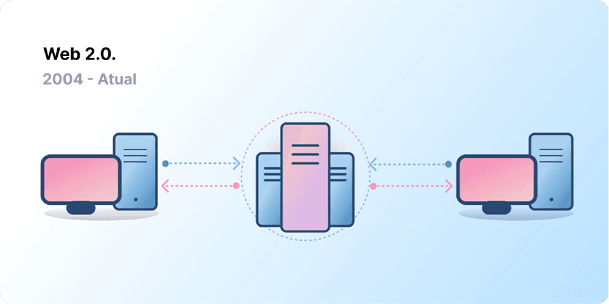
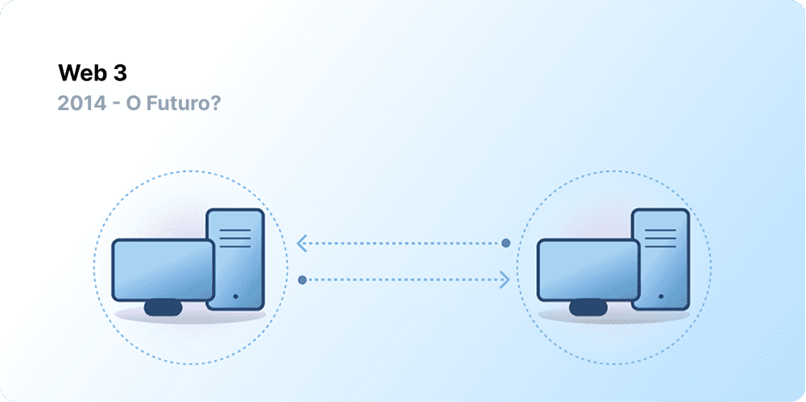

# Introdução à Web3 \{#introduction}

A centralização ajudou a integrar bilhões de pessoas à World Wide Web e criou a infraestrutura estável e robusta em que ela vive. Ao mesmo tempo, um punhado de entidades centralizadas tem uma fortaleza em grandes áreas da World Wide Web, decidindo unilateralmente o que deve e o que não deve ser permitido.

Web3 é a resposta para este dilema. Em vez de uma Web monopolizada por grandes empresas de tecnologia, a Web3 adota a descentralização e está sendo construída, operada e de propriedade de seus usuários. A Web3 coloca o poder nas mãos dos indivíduos e não das corporações. Antes de falarmos sobre Web3, vamos explorar como chegamos aqui.

{
	<Divider />
}

## O início da Web \{#early-internet}

A maioria das pessoas pensa na Web como um pilar contínuo da vida moderna – ela foi inventada e existe desde então. No entanto, a Web que a maioria de nós conhece hoje é bem diferente da imaginada originalmente. Para entender isso melhor, é útil dividir a breve história da Web em períodos separados — Web 1.0 e Web 2.0.

### Web 1.0: Somente leitura (1990-2004) \{#web1}

Em 1989, no CERN, em Genebra, Tim Berners-Lee estava ocupado desenvolvendo os protocolos que se tornariam a World Wide Web. Sua ideia? Criar protocolos abertos e descentralizados que permitissem o compartilhamento de informações de qualquer lugar da Terra.

O primeiro início da criação de Berners-Lee, agora conhecido como 'Web 1.0', ocorreu aproximadamente entre 1990 e 2004. A Web 1.0 era principalmente sites estáticos sob propriedade de empresas, e havia quase zero interação entre os usuários – indivíduos raramente produziam conteúdo – levando-o a ser conhecido como a web somente leitura.

### Web 2.0: Leitura-escrita (2004-agora) \{#web2}

O período da Web 2.0 começou em 2004 com o surgimento das plataformas de mídia social. Em vez de apenas leitura, a web evoluiu para ser de leitura-escrita. Em vez de empresas que fornecem conteúdo aos usuários, elas também começaram a fornecer plataformas para compartilhar conteúdo gerado pelo usuário e se envolver em interações de usuário para usuário. À medida que mais pessoas se tornaram on-line, um punhado de grandes empresas começou a controlar uma quantidade desproporcional do tráfego e do valor gerado na web. A Web 2.0 também deu origem ao modelo de receita baseado em publicidade. Embora os usuários pudessem criar conteúdo, eles não o possuíam ou se beneficiavam de sua monetização.

{
	<Divider />
}

## Web 3.0: Leitura-escrita \{#web3}

A premissa da 'Web 3.0' foi criada pelo cofundador do [Ethereum](/what-is-ethereum/), Gavin Wood, logo após o lançamento do Ethereum em 2014. Gavin colocou em palavras uma solução para um problema que muitos dos primeiros adeptos de criptomoedas sentiram: a Web exigia muita confiança. Ou seja, a maior parte da Web que as pessoas conhecem e usam hoje depende da confiança em um punhado de empresas privadas para agir no melhor interesse do público.

### O que é Web3? \{#what-is-web3}

A Web 3 tornou-se um termo abrangente para a visão de uma Internet nova e melhor. Na sua essência, a Web3 usa blockchains, criptomoedas e NFTs para devolver poder aos usuários sob a forma de propriedade. [Uma publicação de 2021 no Twitter](https://twitter.com/j1mmyeth/status/1459003044067258370) resumiu bem: Web1 foi somente leitura, Web2 é leitura/escrita, Web3 será leitura/escrita/própria.

#### Principais ideias da Web3 \{#core-ideas}

Embora seja um desafio fornecer uma definição rígida do que é Web3, alguns princípios básicos orientam sua criação.

- **Web3 é descentralizada:** em vez de grandes áreas da Internet controladas e de propriedade de entidades centralizadas, a propriedade é distribuída entre seus criadores e usuários.
- **Web3 não tem permissão:** todos têm acesso igual para participar da Web3 e ninguém é excluído.
- **A Web3 possui pagamentos nativos:** ela usa criptomoeda para gastar e enviar dinheiro on-line em vez de depender da infraestrutura desatualizada de bancos e processadores de pagamento.
- **A Web3 tem com necessidade mínima de confiança:** ela opera usando incentivos e mecanismos econômicos em vez de depender de terceiros confiáveis.

### Porque a Web3 é importante? \{#why-is-web3-important}

Embora os recursos matadores do Web3 não sejam isolados e não se encaixem em categorias limpas, por simplicidade, tentamos separá-los para torná-los mais fáceis de entender.

#### Propriedade \{#ownership}

a Web3 dá-lhe posse dos seus ativos digitais de uma forma sem precedentes. Por exemplo, digamos que você está jogando um jogo web2. Se você comprar um item no jogo, ele ficará vinculado diretamente à sua conta. Se os criadores do jogo apagarem sua conta, você perderá esses itens. Ou, se você parar de jogar o jogo, você perde o valor que investiu nos seus itens no jogo.

A Web3 permite a propriedade direta por meio de [tokens não fungíveis (NFTs)](/nft/). Ninguém, nem mesmo os criadores do jogo, consegue tirar sua propriedade. E, se você parar de jogar, pode vender ou trocar seus itens no jogo em mercados abertos e recuperar o seu valor.

<InfoBanner shouldSpaceBetween emoji=":eyes:">
  
Saiba mais sobre NFTs

  <ButtonLink to="/nft/">
    Mais sobre NFTs
  </ButtonLink>
</InfoBanner>

#### Resistência à censura \{#censorship-resistance}

A dinâmica de poder entre plataformas e criadores de conteúdo é massivamente desequilibrada.

OnlyFans é um site de conteúdo adulto gerado pelo usuário com mais de 1 milhão de criadores de conteúdo, muitos dos quais usam a plataforma como sua principal fonte de renda. Em agosto de 2021, o OnlyFans anunciou planos para banir conteúdo sexualmente explícito. O anúncio provocou indignação entre os criadores na plataforma, que sentiram que estavam sendo privados de uma renda na plataforma que ajudaram a criar. Após a repercussão, a decisão foi rapidamente revertida. Apesar dos criadores vencerem essa batalha, isso destaca um problema para os criadores da Web 2.0: você perde a reputação e o número de seguidores acumulados se sair de uma plataforma.

Na Web3, seus dados vivem no blockchain. Quando você decide sair de uma plataforma, pode levar sua reputação com você, conectando-a a outra interface que se alinhe mais claramente aos seus valores.

A Web 2.0 exige que os criadores de conteúdo confiem nas plataformas para não alterar as regras, mas a resistência à censura é uma característica nativa de uma plataforma Web3.

#### Organizações autônomas descentralizadas (DAOs) \{#daos}

Além de possuir seus dados na Web3, você pode possuir a plataforma como um coletivo, utilizando tokens que atuam como ações em uma empresa. As DAOs permitem que você coordene a propriedade descentralizada de uma plataforma e tome decisões sobre seu futuro.

DAOs são definidas tecnicamente como contratos inteligentes acordados que automatizam a tomada de decisão descentralizada sobre um conjunto de recursos (tokens). Os usuários com tokens votam sobre como os recursos são gastos e o código executa automaticamente o resultado da votação.

No entanto, as pessoas definem muitas comunidades Web3 como DAOs. Todas essas comunidades têm diferentes níveis de descentralização e automação por código. Atualmente, estamos explorando o que são DAOs e como elas podem evoluir no futuro.

<InfoBanner shouldSpaceBetween emoji=":eyes:">
  
Saiba mais sobre DAOs

  <ButtonLink to="/dao/">
    Mais sobre DAOs
  </ButtonLink>
</InfoBanner>

### Identidade \{#identity}

Geralmente, você cria uma conta para cada plataforma que usa. Por exemplo, você pode ter uma conta no Twitter, uma no YouTube e uma no Reddit. Deseja mudar o seu nome de exibição ou foto de perfil? Você tem que fazer isso em cada conta. Você pode usar logins sociais em alguns casos, mas isso apresenta um problema familiar: a censura. Em um único clique, estas plataformas podem bloquear você de toda sua vida on-line. Pior ainda, muitas plataformas exigem que você confie nelas informações de identificação pessoal para criar uma conta.

A Web3 resolve esses problemas, permitindo que você controle sua identidade digital com um endereço Ethereum e um perfil ENS. O uso de um endereço Ethereum fornece um único login entre plataformas seguras, resistentes à censura e anônimas.

<ButtonLink to="https://login.xyz/">
  Entrar com Ethereum
</ButtonLink>

### Pagamentos nativos \{#native-payments}

A infraestrutura de pagamento da Web2 depende de bancos e processadores de pagamento, excluindo pessoas sem contas bancárias ou aquelas que vivem dentro das fronteiras do país errado. A Web3 usa tokens como [ETH](/eth/) para enviar dinheiro diretamente no navegador e não requer terceiros confiáveis.

<ButtonLink to="/eth/">
  Mais sobre ETH
</ButtonLink>

## Limitações da Web3 \{#web3-limitations}

Apesar dos inúmeros benefícios da Web3 em sua forma atual, ainda existem muitas limitações que o ecossistema deve abordar para que floresça.

### Acessibilidade \{#accessibility}

Recursos importantes da Web3, como Entrar com Ethereum, ou seja, fazer login com o Ethereum, já estão disponíveis para qualquer pessoa usar a custo zero. Mas, o custo relativo das transações ainda é proibitivo para muitos. É menos provável que a Web3 seja utilizada em países menos ricos e em desenvolvimento devido às altas taxas de transação. No Ethereum, esses desafios estão sendo resolvidos por meio do [roteiro](/roadmap/) e das [soluções de dimensionamento da camada 2](/developers/docs/scaling/). A tecnologia está pronta, mas precisamos de níveis mais altos de adoção na camada 2 para tornar a Web3 acessível a todos.

### Experiência do usuário \{#user-experience}

A barreira técnica de entrada para o uso da Web3 é, atualmente, muito alta. Os usuários devem compreender as preocupações de segurança, entender a documentação técnica complexa e navegar por interfaces de usuário não intuitivas. Os [provedores de carteiras](/wallets/find-wallet/), em particular, estão trabalhando para resolver isso, mas é necessário um progresso maior para que a Web3 seja adotada em massa.

### Instrução \{#education}

A Web3 introduz novos paradigmas que requerem o aprendizado de diferentes modelos mentais quando comparado com os usados na Web2.0. Uma motivação instrucional similar aconteceu quando a Web1.0 ganhou popularidade no final da década de 1990; os defensores da World Wide Web utilizaram uma grande quantidade de técnicas acadêmicas para instruir o público usando metáforas simples (a autoestrada da informação, navegadores, navegando na web) para [transmissões de televisão](https://www.youtube.com/watch?v=SzQLI7BxfYI). A Web3 não é difícil, mas é diferente. As iniciativas educacionais que informam os usuários da Web2 sobre esses paradigmas da Web3 são vitais para o seu sucesso.

O Ethereum.org contribui para a instrução em Web3 através do nosso [Programa de Tradução](/contributing/translation-program/), que possui o objetivo de traduzir importantes conteúdos do Ethereum para o maior número possível de idiomas.

### Infraestrutura centralizada \{#centralized-infrastructure}

O ecossistema Web3 é jovem e está evoluindo rapidamente. Como resultado, atualmente, depende principalmente de uma infraestrutura centralizada (GitHub, Twitter, Discord etc.). Muitas empresas Web3 estão correndo para preencher essas lacunas, mas, construir uma infraestrutura confiável e de alta qualidade, leva tempo.

## Um futuro descentralizado \{#decentralized-future}

A Web3 é um ecossistema jovem e em evolução. Gavin Wood criou o termo em 2014, mas muitas destas ideias só recentemente se tornaram uma realidade. Somente no ano passado, houve um aumento considerável no interesse em criptomoedas, melhorias nas soluções de dimensionamento da camada 2, experimentos maciços com novas formas de governança e revoluções na identidade digital.

Estamos apenas no início da criação de uma Web melhor com a Web3, mas à medida que continuamos a melhorar a infraestrutura que a suportará, o futuro da Web parece brilhante.

## Como posso participar \{#get-involved}

- [Obtenha uma carteira](/wallets/)
- [Encontre uma comunidade](/community/)
- [Explore aplicativos Web3](/dapps/)
- [Participe de uma DAO](/dao/)
- [Construir na Web3](/developers/)

## Leitura adicional \{#further-reading}

Web3 não é rigidamente definida. Vários participantes da comunidade têm diversas perspectivas sobre isso. Veja aqui alguns deles:

- [O que é Web3? A Internet Descentralizada do Futuro Explicada](https://www.freecodecamp.org/news/what-is-web3/) – _Nader Dabit_
- [Compreendendo a Web 3](https://medium.com/l4-media/making-sense-of-web-3-c1a9e74dcae) – _Josh Stark_
- [Por que a Web3 é Importante?](https://future.a16z.com/why-web3-matters/) — _Chris Dixon_
- [Por que a descentralização é importante?](https://onezero.medium.com/why-decentralization-matters-5e3f79f7638e) _Feb-, - Chris Dixon_
- [O Cenário Web3](https://a16z.com/wp-content/uploads/2021/10/The-web3-Readlng-List.pdf) – _a16z_
- [O Debate Web3](https://www.notboring.co/p/the-web3-debate?s=r) – _Packy McCormick_

{
	<QuizWidget quizKey="web3" />
}
