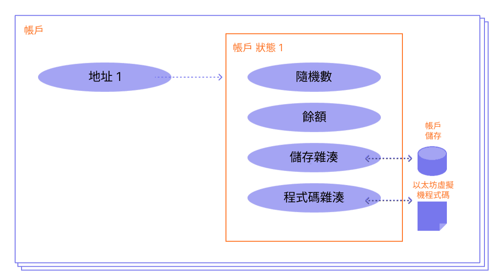

以太坊帳戶是一個擁有以太幣 (ETH) 餘額且可以在以太坊上發送交易的實體。 帳戶可以為使用者控制的帳戶，或為智慧型合約形式的帳戶。

## 基本資訊 {#prerequisites}

為了讓你更容易理解本頁，建議你先通讀我們的[以太坊介紹](/developers/docs/intro-to-ethereum/)。

## 帳戶類型 {#types-of-account}

以太坊有兩種帳戶類型：

- 外部帳戶 (EOA) – 由任何持有私密金鑰的人控制
- 合約帳戶 – 部署在網路上的智慧型合約，由程式碼控制。 瞭解[智慧型合約](/developers/docs/smart-contracts/)。

這兩種帳戶類型都能：

- 接收、存放和發送以太幣和代幣
- 與部署的智慧型合約互動

### 主要差異 {#key-differences}

**外部帳戶**

- 建立帳戶是免費的
- 能夠發起交易
- 外部帳戶之間的交易只能是以太幣/代幣轉帳
- 由密碼學金鑰組組成：公開以及私密金鑰控制帳戶活動

**合約帳戶**

- 建立帳戶會佔用網路儲存因此會產生費用
- 只能在接受到交易時發送交易
- 從外部帳戶向合約帳戶發送的交易能觸發程式碼，並能執行多種不同操作：例如傳送代幣，甚至建立新合約。
- 合約帳戶沒有私密金鑰。 但它們由智慧型合約程式碼的邏輯控制

## 帳戶檢視 {#an-account-examined}

以太坊帳戶有四個欄位：

- `nonce` – 一個計數器，指示外部帳戶發送的交易數量或合約帳戶建立的合約數量。 對於每個帳戶，一筆特定 Nonce 的交易只能執行一次，這是未了防範重放攻擊，即不斷地廣播並重覆執行已簽署的交易。
- `balance` – 該地址擁有的 Wei 的數量。 Wei 是以太幣的面額，1 以太幣等於 1e+18 個 Wei。
- `codeHash` -- 此雜湊值指帳戶於以太坊虛擬機 (EVM) 上的*程式碼*。 包含了程式碼片段的合約帳戶可以執行不同操作。 對帳戶進行訊息調用時，執行此以太坊虛擬機程式碼。 不同於帳戶的其他欄位，此欄位無法更改。 所有此等程式碼片段都包含於狀態資料庫中其對應的雜湊值下，以便日後擷取。 此雜湊值稱為 codeHash。 對於外部帳戶，codeHash 欄位是空字串的雜湊值。
- `storageRoot` – 有時稱為儲存雜湊值。 梅克爾帕特里夏樹之根節點的 256 位雜湊值，它對帳戶的儲存內容進行編碼（256 位整數值之間的映射），在樹形資料結構中編碼成 256 位整數鍵的雜湊值到 RPL 編碼的 256 位整數值之間的映射。 該樹形資料結構對此帳戶的儲存內容的雜湊值進行編碼，且默認為空白。

 _此圖表源於[以太坊的以太坊虛擬機圖解](https://takenobu-hs.github.io/downloads/ethereum_evm_illustrated.pdf)_

## 外部帳戶和金鑰組 {#externally-owned-accounts-and-key-pairs}

帳戶由加密金鑰組組成：公開金鑰及私密金鑰。 金鑰組有助於證明交易確實由發送者簽署，並可防止偽造。 私密金鑰用於簽署交易，為你授予與帳戶相關的資金的監管權。 你從未真正持有加密貨幣，你持有的是私密金鑰 – 資金始終處於以太坊帳本中。

這樣可防止惡意行為者廣播假造交易，因為你始終都能驗證交易的發送者。

假設 Alice 想從自己的帳戶給 Bob 的帳戶發送以太幣，她須建立交易請求並發送到網路上進行驗證。 以太坊採用公開金鑰加密，這能確保 Alice 可以證明是她自己最初發起了該交易請求。 如果沒有加密機制，惡意對手 Eve 就能輕鬆廣播一個請求，例如「從 Alice 的帳戶給 Eve 的帳戶發送 5 以太幣」。沒有人能夠驗證這個請求不是 Alice 發送的。

## 建立帳戶 {#account-creation}

當你想建立一個帳戶時，大多數程式庫會為你產生一個隨機私密金鑰。

私密金鑰由 64 個十六進位字元組成並且能夠使用密碼加密。

範例：

`fffffffffffffffffffffffffffffffebaaedce6af48a03bbfd25e8cd036415f`

公開金鑰是使用[橢圓曲線數位簽名演算法](https://wikipedia.org/wiki/Elliptic_Curve_Digital_Signature_Algorithm)從私密金鑰產生的。 你的帳戶的公開地址由公開金鑰 Keccak-256 雜湊值的後 20 位在開頭加上 `0x` 組成。

下面的範例展示如何使用一種簽名工具 [Clef](https://geth.ethereum.org/docs/tools/clef/introduction) 來產生一個新帳戶。 Clef 是一種與以太坊用戶端 [Geth](https://geth.ethereum.org) 綁定的帳戶管理與簽名工具。 `clef newaccount` 命令建立一個新的金鑰組並將其儲存於加密的密鑰庫。

```
> clef newaccount --keystore <path>

Please enter a password for the new account to be created:
> <password>

------------
INFO [10-28|16:19:09.156] Your new key was generated       address=0x5e97870f263700f46aa00d967821199b9bc5a120
WARN [10-28|16:19:09.306] Please backup your key file      path=/home/user/go-ethereum/data/keystore/UTC--2022-10-28T15-19-08.000825927Z--5e97870f263700f46aa00d967821199b9bc5a120
WARN [10-28|16:19:09.306] Please remember your password!
Generated account 0x5e97870f263700f46aa00d967821199b9bc5a120
```

[Geth 文件](https://geth.ethereum.org/docs)

可以透過私密金鑰衍生出公開金鑰，但無法使用公開金鑰衍生出私密金鑰。 顧名思義，**私密**意味著保障私密金鑰安全很重要。

你需要使用私密金鑰來簽署訊息和交易，並輸出一個簽章。 之後，其他人能夠使用該簽章衍生出你的公開金鑰，證明你是這條訊息的創作者。 在你的應用程式中，你可以使用 JavaScript 程式庫將交易發送至網路。

## 合約帳戶 {#contract-accounts}

合約帳戶亦有一個含有 42 個字元的 16 進位地址：

案例：

`0x06012c8cf97bead5deae237070f9587f8e7a266d`

當在以太坊區塊鏈上部署一個合約時，通常給出合約地址。 合約地址由創作者地址及該地址發送的交易數量組成（「nonce」）。

## 驗證者金鑰 {#validators-keys}

以太坊還有另一種金鑰，是在以太坊的共識機制從工作量證明過渡到權益證明時引入的。 它們是「BLS」金鑰，且被用於識別驗證者。 這些金鑰能有效地聚合起來，從而降低網路達成共識所需的帶寬。 如果沒有此等金鑰聚合，成為驗證者所需的最低質押量會高出許多。

[更多驗證者金鑰相關資訊](/developers/docs/consensus-mechanisms/pos/keys/)。

## 關於錢包的備註 {#a-note-on-wallets}

帳戶並非錢包。 帳戶是使用者持有的以太坊帳戶的金鑰組。 錢包則是一個介面或應用程式，讓你能夠和你的以太坊帳戶互動。

## 視覺範例 {#a-visual-demo}

觀看 Austin 為你全面講解雜湊函式和金鑰組。

{
<YouTube id="QJ010l-pBpE" />
}

{
<YouTube id="9LtBDy67Tho" />
}

## 延伸閱讀 {#further-reading}

- [了解以太坊帳戶](https://info.etherscan.com/understanding-ethereum-accounts/) - etherscan

_知道一個曾經幫助你學習更多社區或社團資源? 歡迎在本頁自由編輯或添加內容！！_

## 相關主題 {#related-topics}

- [智慧型合約](/developers/docs/smart-contracts/)
- [異動](/developers/docs/transactions/)
