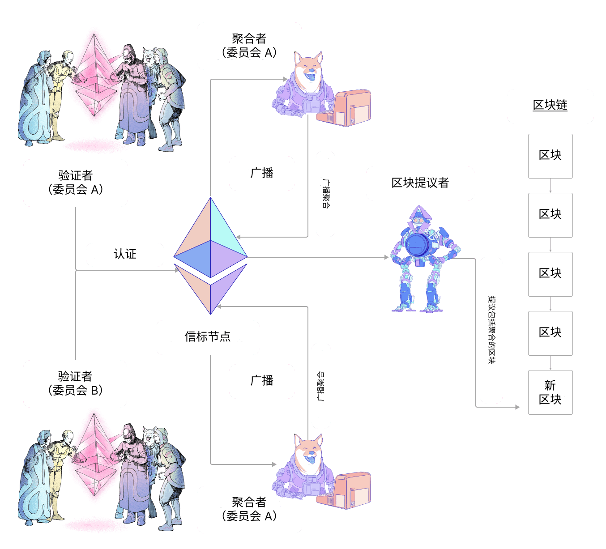

验证者需要在每个时段创建、签名和广播认证。 本页面概述了这些认证是什么样的，以及他们是如何被处理和如何在共识客户端交流的。

## 什么是认证？ \{#what-is-an-attestation}

每个[时段](/glossary/#epoch)（6.4 分钟）验证者都会向网络提议一个认证。 这个认证是针对时段中的一个特定时隙。 认证的目的是投票赞成验证者对于链的看法，特别是最近的合理区块和当前时段的第一个区块（被称为`来源`和`目标`检查点）。 所有参与的验证者的信息都会合并，使得网络可以达成关于区块链状态的共识。

认证包含以下组成部分：

- `aggregation_bits`：验证者的位列表，其位置映射到委员会中的验证者索引；(0/1) 数值表示验证者是否签名了`数据`（即，他们是否活跃和同意区块提议者）
- `data`：与认证相关的细节，如下方的定义
- `signature`：聚合了个人验证者签名的 BLS 签名

证明验证者的第一项任务是创建 `data`。 `data` 包含以下信息：

- `slot`：认证指向的时隙号
- `index`：一个数字，用来识别在给定的时隙中，验证者所属的委员会
- `beacon_block_root`：验证者在链头看到的区块的根哈希（应用分叉选择算法的结果）
- `source`：最终确定性投票的一部分，表示验证者认为的最新的合理区块
- `target`：最终确定性投票的一部分，表示验证者认为的当前时段的第一个区块

一旦 `data` 构造完成，验证者就可以将 `aggregation_bits` 中对应于他们自己的验证者索引的位从 0 翻转到 1，以表明他们已经参与。

最终，验证者签名认证并且在网络进行广播。

### 聚合的认证 \{#aggregated-attestation}

对于验证者来说，在网络传递此数据需要大量的开销。 因此，在更加广泛地广播前，个人验证者的认证会在子网内进行聚合。 这包括聚合签名，以便广播的认证包含共识 `data` 和一个签名，后者结合了所有同意 `data` 的验证者的签名。 这可以使用 `aggregation_bits` 来检查，因为它提供了委员会中每个验证者的索引（其 ID 在 `data` 中提供），可用于查询个人签名。

在每个时段，每个子网中会有一个验证者被选为 `aggregator`（聚合者）。 聚合者收集所有在网络听到的，与他们自己的 `data` 相同的所有认证。 每一个匹配认证的发送者被记录在 `aggregation_bits` 中。 然后聚合者会把聚合的认证广播到更广泛的网络。

当一个验证者被选为区块提议者时，他们打包从子网到新区块最新时隙的聚合认证。

### 认证纳入生命周期 \{#attestation-inclusion-lifecycle}

1. 生成
2. 传播
3. 聚合
4. 传播
5. 纳入

认证的生命周期在下面的示意图中概述：

## 奖励 \{#rewards}

验证者提交认证将获得奖励。 认证奖励取决于两个变量，`base reward` 和 `inclusion delay`。 最佳的纳入延迟等于 1。

`认证奖励 = 7/8 x 基础奖励 x (1/纳入延迟)`

### 基础奖励 \{#base-reward}

基础奖励根据证明验证者的数量及其有效质押以太币余额来计算：

`base reward = validator effective balance x 2^6 / SQRT(Effective balance of all active validators)`

#### 纳入延迟 \{#inclusion-delay}

在验证者对链头 (`block n`) 进行投票，并且 `block n+1` 还没有被提出的时候。 认证自然会在**一个区块后**被包含，因此，投票给 `block n` 称为链头的所有认证被包含在 `block n+1` 中，其**纳入延迟**为 1。 如果纳入延迟加倍到两个时隙，那么认证奖励将减半，因为认证奖励等于基础奖励乘以纳入延迟的倒数。

### 认证场景 \{#attestation-scenarios}

#### 缺失投票验证者 \{#missing-voting-validator}

验证者最多有 1 个时段来提交他们的认证。 如果在时段 0 缺失了认证，那就可以在时段 1 中提交并且附带纳入延迟。

#### 缺失聚合者 \{#missing-aggregator}

每个时段总共有 16 个聚合者。 此外，随机验证者订阅了**两个子网的 256 个时段**，在聚合者缺失的情况下作为备份。

#### 缺失区块提议者 \{#missing-block-proposer}

请注意，在某些情况下，幸运的聚合者可能也会成为区块提议者。 如果因为区块提议者缺失导致认证没有被包含，下一个区块提议者会捡起聚合的认证并将其包含到下一个区块中。 但是，**纳入延迟**将会增加 1。

## 延伸阅读 \{#further-reading}

- [Vitalik 的注释共识规范中的认证](https://github.com/ethereum/annotated-spec/blob/master/phase0/beacon-chain.md#attestationdata)
- [eth2book.info 中的认证](https://eth2book.info/altair/part3/containers/dependencies#attestationdata)

_还有哪些社区资源对你有所帮助？ 编辑并添加本页面！_
