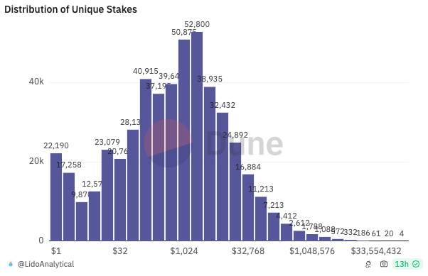

In the ever-evolving landscape, Liquid Staking Derivatives (LSDs) have emerged as a significant area of interest.

However, as with any burgeoning market, some challenges and opportunities need careful consideration. This post delves into the hurdles newer staking pools face, users' behavior in this space, and the critical role of user experience.

## The Staking Pool Challenge  {#the-staking-pool-challenge}
Newer staking pools often find themselves in a tight spot when competing against established players in the market. 

These larger players command substantial liquidity, making it challenging for new entrants to attract users and offer competitive yields.

A few major players have established a stronghold in the LST (Liquid Staking Tokens) market. This dominance poses a significant barrier for newer pools trying to carve out their niche.

**Why do new pools obsess over liquidity when it's a fight they cannot win?**

## Complexity vs. Clarity  {#complexity-vs-clarity}
In an attempt to differentiate themselves, many new pools are turning to intricate staking setups. 
This often results in complex systems that may need to be clarified for users, creating potential barriers to adoption. 

**The need for simplicity and clarity must be balanced in attracting and retaining users.**

<iframe width="560" height="315" src="https://www.youtube.com/embed/1xw3CL_YxuY?si=InGDNhRcK1PcyQWC" title="YouTube video player" frameborder="0" allow="accelerometer; autoplay; clipboard-write; encrypted-media; gyroscope; picture-in-picture; web-share" referrerpolicy="strict-origin-when-cross-origin" allowfullscreen></iframe>

## Understanding User Behavior  {#understanding-user-behavior}

Specifically, 224,000 users staked $1024 or less, and 125,000 users staked between $1024 to $32,000, demonstrating the varied investment strategies in play (October 2023)

**Staking pool projects tend to communicate to each user the same way. This is wrong.**

A user with 1 ETH and 100 ETH has a different risk profile/strategy they are thinking about. **This creates an opportunity to offer a tailored and targeted product to the unique needs** instead of trying to attract everyone and fail.

- 224k users staked $1024 or less
- 125k users staked between $1024 and $32k
- 24k users staked between $32k to $1 million
- Exchange users average around $600 

Surprisingly, 65% of users need to actively manage their stETH to increase yield. (October 2023)

This finding highlights a potential gap in user engagement and addresses the issue that everyone is leaning into more complex Liquid Staking Strategies when even the most simple ones are **not attractive to users**.

## The Importance of UX  {#importance-of-ux}
The disparity in how investors understand and use Liquid staking points to a need for better UX design. 

The concept of rebasing (1 LSD = 1 ETH) versus reward-bearing LSDs (1 LSD = ? ETH) can be confusing.

Issues like full deposit queues further complicate the user's journey. 

A well-designed UX can demystify these concepts and make the investment process more intuitive and accessible.

**Where are your users? How can you get in front of them? How can you understand their desires?**
Coinbase is a great example as they originally started with no liquid staking token and are now one of the largest staking pools (and charge more than the competition)

The market, while promising, is fraught with challenges that require **strategic thinking** and **user-centric solutions**. 

## User Research  {#user-research}

Most projects should ask these questions:

- What are users doing with their LST?
- What would motivate them to move from a competitor?
- What is most important for the user?
- What do you know about the risks and rewards associated with staking?
- Who is your staking pool targeting?

As the market evolves,** it will be crucial for new projects to focus on clear, simple, and user-friendly platforms**.

Understanding and catering to user behavior will be **vital** in building successful and sustainable staking pools in the competitive landscape of DeFi.

